## 커널 (Kernel) 이란 무엇인가

커널은 운영체제의 핵심 부분으로, 하드웨어와 소프트웨어를 연결하는 계층이다. 애플리케이션들이 하드웨어 자원 (CPU, 메모리, 디스크, 네트워크 등) 을 안전하고 효율적으로 공유할 수 있도록 중재하고 관리한다.

### 커널이 필요하게 된 역사적 배경

초기 컴퓨터 (1940~1950 년대) 는 한 번에 하나의 프로그램만 실행했다. 프로그램이 하드웨어를 직접 제어했고, 프로그램이 종료되면 다음 프로그램을 로드했다. 이 방식은 단순했지만 몇 가지 문제가 있었다:

1. **자원 낭비**: CPU 가 I/O 작업 (디스크 읽기 등) 을 기다리는 동안 유휴 상태로 있었다.
2. **안전성 부족**: 프로그램의 버그가 전체 시스템을 멈추게 할 수 있었다.
3. **비효율성**: 여러 사용자가 컴퓨터를 공유하려면 물리적으로 차례를 기다려야 했다.

이러한 문제를 해결하기 위해 **멀티프로그래밍** 과 **시분할 (time-sharing)** 개념이 등장했다 (1960 년대). 여러 프로그램을 메모리에 동시에 로드하고, CPU 시간을 빠르게 나눠주면서 마치 동시에 실행되는 것처럼 보이게 했다. 이때 **프로그램들 간의 중재자 역할** 이 필요했고, 이것이 커널의 시작이다.

### 커널의 핵심 역할

#### 1. 프로세스 스케줄링

여러 프로세스가 동시에 실행되려면 CPU 를 공정하게 나눠야 한다. 1960 년대 **Multics** 시스템에서 처음 구현된 스케줄러는 각 프로세스에 타임슬라이스 (time slice) 를 할당했다. 현대 리눅스의 **CFS(Completely Fair Scheduler)** 는 이를 발전시켜, 모든 프로세스가 "공정한" CPU 시간을 받도록 보장한다.

```mermaid
graph TD
    A[프로세스 A] -->|실행 3ms| CPU
    B[프로세스 B] -->|실행 3ms| CPU
    C[프로세스 C] -->|실행 3ms| CPU
    CPU -->|타이머 인터럽트| Scheduler[스케줄러]
    Scheduler -->|다음 프로세스 선택| A
```



**왜 이렇게 설계되었나?**

초기 스케줄러는 단순 라운드로빈 방식이었지만, 이는 CPU 집약적 작업과 I/O 집약적 작업을 구분하지 못했다. 예를 들어, 텍스트 에디터는 사용자 입력을 기다리는 시간이 많아 CPU 를 거의 쓰지 않지만, 빠른 응답성이 필요하다. 반면 동영상 인코딩은 CPU 를 지속적으로 사용한다. CFS 는 각 프로세스의 실제 실행 시간 (vruntime) 을 추적해, 덜 실행된 프로세스에 우선권을 준다.

#### 2. 메모리 관리

초기 멀티프로그래밍 시스템에서는 메모리를 고정 크기로 나눴다 (partition). 하지만 프로그램 크기가 다양해지면서 메모리 낭비가 심했다.

1960 년대 말 **[[virtual-memory|가상 메모리]](Virtual Memory)** 개념이 등장했다. 각 프로그램은 자신만의 독립된 주소 공간을 가지고, 실제 물리 메모리는 운영체제가 숨겨서 관리한다. 이를 통해:

- **메모리 격리**: 프로그램 A 가 프로그램 B 의 메모리를 침범할 수 없다.
- **효율성**: 자주 사용하지 않는 메모리는 디스크로 내보낸다 (swap).
- **큰 주소 공간**: 물리 메모리보다 큰 가상 주소 공간을 제공한다.

```mermaid
graph LR
    subgraph 프로세스 A
        VA1[가상 주소 0x1000]
    end
    subgraph 프로세스 B
        VA2[가상 주소 0x1000]
    end
    subgraph 물리 메모리
        PA1[물리 주소 0x5000]
        PA2[물리 주소 0x8000]
    end
    VA1 -->|MMU 변환| PA1
    VA2 -->|MMU 변환| PA2
```

**왜 페이지 단위로 나눴나?**

초기에는 프로그램 전체를 메모리에 올리거나 디스크로 내보냈다 (swapping). 하지만 프로그램이 커지면서 이는 비효율적이었다. **[[virtual-memory#페이징(Paging)|페이징(Paging)]]** 방식은 메모리를 고정 크기 (보통 4KB) 로 나눠, 필요한 페이지만 메모리에 올린다. 프로그램은 코드를 순차적으로 실행하고, 데이터도 지역성 (locality) 을 가지므로, 전체 프로그램의 일부만 메모리에 있어도 대부분의 시간 동안 정상 작동한다.

#### 3. 파일 시스템

초기 컴퓨터는 테이프나 펀치 카드를 사용했다. 데이터는 순차적으로만 접근할 수 있었다. 디스크 드라이브가 등장하면서 **[[random-access|랜덤 액세스]]** 가 가능해졌고, 파일을 계층적으로 구조화할 필요가 생겼다.

Unix(1970 년대) 는 **"모든 것은 파일이다"** 라는 철학을 도입했다. 일반 파일뿐만 아니라 디바이스, 프로세스 정보도 파일처럼 다룬다. 이를 위해 **VFS(Virtual File System)** 레이어를 추가해, 다양한 파일 시스템 (ext4, XFS, NFS 등) 을 통일된 인터페이스로 접근할 수 있게 했다.

```mermaid
graph TD
    App[애플리케이션] -->|read/write| VFS[VFS Layer]
    VFS --> ext4[ext4 파일시스템]
    VFS --> XFS[XFS 파일시스템]
    VFS --> NFS[NFS 네트워크 파일시스템]
    ext4 --> Disk1[로컬 디스크]
    XFS --> Disk2[로컬 디스크]
    NFS --> Network[네트워크]
```



**Inode 의 등장 배경**

초기 파일 시스템은 파일 이름과 데이터를 직접 연결했다. 하지만 하드 링크 (여러 이름이 같은 파일을 가리킴) 를 지원하려면 파일의 메타데이터를 분리해야 했다. **Inode** 는 파일의 실제 데이터 위치, 권한, 크기, 타임스탬프를 저장하고, 디렉토리는 "파일 이름 → Inode 번호" 매핑만 관리한다.

#### 4. 시스템 콜 인터페이스

프로그램이 하드웨어를 직접 제어하면 위험하다. 예를 들어, 프로그램이 다른 프로세스의 메모리를 읽거나, 디스크를 임의로 포맷할 수 있다. **[[cpu-privilege-levels|특권 모드(Privileged Mode)]]**와 **사용자 모드 (User Mode)** 분리가 필요했다.

CPU 는 두 가지 모드를 지원한다:

- **[[cpu-privilege-levels#Ring 0 (Kernel Mode)|커널 모드 (Ring 0)]**: 모든 명령 실행 가능, 하드웨어 직접 제어.
- **[[cpu-privilege-levels#Ring 3 (User Mode)|사용자 모드 (Ring 3)]**: 제한된 명령만 실행 가능, 시스템 콜을 통해 커널에 요청.

**시스템 콜 (System Call)** 은 사용자 프로그램이 커널에게 "이 작업을 대신 해줘"라고 요청하는 메커니즘이다. 예를 들어, 파일을 읽으려면 `read()` 시스템 콜을 호출한다. 커널은 권한을 확인하고, 디스크 드라이버를 통해 데이터를 읽어 돌려준다.

```mermaid
sequenceDiagram
    participant App as 사용자 프로그램
    participant Lib as libc
    participant Kernel as 커널
    participant HW as 하드웨어
    
    App->>Lib: fread(file)
    Lib->>Kernel: syscall: read()
    Note over Kernel: 모드 전환 (usermode → kernel mode)
    Kernel->>Kernel: 권한 확인
    Kernel->>HW: 디스크 읽기 명령
    HW-->>Kernel: 데이터 반환
    Kernel-->>Lib: 데이터 복사
    Note over Kernel: 모드 전환 (kernel mode → usermode)
    Lib-->>App: 데이터 반환
```



**왜 시스템 콜은 느린가?**

모드 전환에는 비용이 든다. CPU 레지스터를 저장하고, 페이지 테이블을 교체하고, TLB(Translation Lookaside [[buffer|Buffer]]) 를 비워야 한다. 캐시 일관성도 영향을 받는다. 하지만 이 비용은 **보안과 안정성**을 위한 필수적인 대가다. vDSO(virtual Dynamic Shared Object) 같은 최적화로 일부 시스템 콜 (예: `gettimeofday`) 은 모드 전환 없이 유저 공간에서 처리한다.

---

## 커널 아키텍처의 진화

### 모놀리식 커널 (Monolithic Kernel)

초기 Unix 와 Linux 는 **모놀리식** 구조다. 파일 시스템, 네트워크 스택, 디바이스 드라이버가 모두 커널 공간에서 실행된다.

**장점**:
- 컴포넌트 간 통신이 빠르다 (함수 호출만으로 충분).
- 성능이 좋다 (컨텍스트 스위칭 최소).

**단점**:
- 하나의 드라이버 버그가 전체 시스템을 다운시킬 수 있다.
- 커널 크기가 커진다.

```mermaid
graph TB
    subgraph 모놀리식 커널
        FS[파일시스템]
        NET[네트워크 스택]
        DEV[디바이스 드라이버]
        SCHED[스케줄러]
        MEM[메모리 관리]
    end
    App[애플리케이션] -->|시스템 콜| FS
    App -->|시스템 콜| NET
    FS -.함수 호출.-> MEM
    NET -.함수 호출.-> SCHED
```

### 마이크로 커널 (Microkernel)

1980 년대 **Mach**, **L4** 같은 마이크로 커널이 등장했다. 커널은 최소한의 기능 (IPC, 스케줄링, 기본 메모리 관리) 만 담당하고, 파일 시스템과 드라이버는 유저 공간 프로세스로 분리했다.

**장점**:
- 안정성 향상: 드라이버 크래시가 커널을 멈추지 않는다.
- 모듈화: 컴포넌트를 독립적으로 재시작 가능.

**단점**:
- 성능 저하: 컴포넌트 간 통신에 메시지 패싱 필요, IPC 오버헤드.
- 복잡성 증가: 시스템 설계가 어렵다.

```mermaid
graph TB
    subgraph 유저 공간
        FS_Server[파일시스템 서버]
        NET_Server[네트워크 서버]
        DEV_Server[디바이스 서버]
    end
    subgraph 마이크로 커널
        IPC[IPC 메커니즘]
        SCHED[스케줄러]
        MEM[메모리 관리]
    end
    App[애플리케이션] -->|IPC 메시지| FS_Server
    FS_Server -->|IPC| IPC
    IPC --> DEV_Server
```

**왜 모놀리식이 여전히 주류인가?**

성능 차이가 결정적이었다. 1990 년대 연구 ([Engler et al.](https://pdos.csail.mit.edu/6.828/2008/readings/exokernel.pdf)) 에 따르면, 마이크로 커널의 IPC 오버헤드는 모놀리식 대비 3~5 배 높았다. Linux 같은 모놀리식 커널은 동적 모듈로 일부 이점 (모듈 로드/언로드) 을 제공하면서도 성능을 유지했다.

### 하이브리드 접근

**Windows NT**와 **macOS(XNU)** 는 하이브리드 방식이다. 기본은 모놀리식이지만, 일부 컴포넌트는 유저 공간으로 분리한다. 예를 들어, Windows 의 User32(윈도우 매니저) 는 커널 모드였다가 Vista 이후 유저 모드로 이동했다 (안정성 향상).

---

## 주요 커널 서브시스템과 설계 결정

### 1. 프로세스 vs 스레드

초기 Unix 는 **프로세스**만 지원했다. 각 프로세스는 독립된 메모리 공간을 가졌다. 하지만 1980 년대 멀티코어 CPU 와 GUI 애플리케이션 등장으로 **경량 프로세스 (스레드)** 필요성이 커졌다.

**문제**: 프로세스 생성은 비싸다. `fork()` 는 부모 프로세스의 메모리를 복사해야 한다 (Copy-on-Write 로 최적화되었지만).

**해결**: **스레드**는 같은 주소 공간을 공유하면서 독립적으로 실행된다. 생성 비용이 낮고, 데이터 공유가 쉽다.

**Linux 의 접근**: Linux 는 스레드를 "공유 메모리를 가진 프로세스"로 구현한다. `clone()` 시스템 콜로 메모리, 파일 디스크립터, 시그널 핸들러 등을 선택적으로 공유한다. 이는 `pthread` 라이브러리의 기반이다.

### 2. 인터럽트 처리

하드웨어 (키보드, 디스크, 네트워크 카드) 가 작업을 완료하면 CPU 에 **인터럽트**를 걸어 알린다. 초기 시스템은 **폴링 (Polling)** 방식이었다: CPU 가 반복적으로 하드웨어 상태를 확인했다. 이는 CPU 를 낭비했다.

**인터럽트 방식**은 하드웨어가 능동적으로 신호를 보낸다. CPU 는 즉시 현재 작업을 중단하고, 인터럽트 핸들러를 실행한다.

**문제**: 인터럽트 핸들러가 너무 오래 실행되면, 다른 인터럽트가 지연되거나 누락될 수 있다.

**해결**: **Top Half / Bottom Half** 분리.
- **Top Half**: 인터럽트 핸들러의 필수 부분만 빠르게 실행 (예: 네트워크 패킷을 버퍼에 복사).
- **Bottom Half**: 나머지 처리는 나중에 실행 (softirq, tasklet, workqueue). 다른 인터럽트가 허용된다.

```mermaid
graph TD
    HW[하드웨어 이벤트] -->|인터럽트 신호| CPU
    CPU -->|Top Half| IH[인터럽트 핸들러]
    IH -->|빠른 처리| ACK[하드웨어에 ACK]
    IH -->|작업 등록| BH[Bottom Half Queue]
    BH -->|나중에 실행| Process[느린 처리]
```



### 3. 동기화와 락

멀티코어 시대 (2000 년대~) 에는 여러 CPU 가 동시에 커널 코드를 실행한다. **Race Condition**(경쟁 상태) 이 발생할 수 있다: 두 CPU 가 동시에 같은 데이터를 수정하면 불일치가 생긴다.

**해결책**:
- **Spinlock**: 짧은 임계 구역용. 락을 못 얻으면 계속 반복해서 확인 (busy-wait).
- **Mutex**: 긴 임계 구역용. 락을 못 얻으면 슬립 (대기 큐에 들어감).
- **RCU(Read-Copy-Update)**: 읽기가 압도적으로 많은 경우. 읽기는 락 없이 진행, 쓰기는 복사본을 만들어 업데이트 후 포인터를 원자적으로 교체.

**왜 Spinlock 은 sleep 하면 안 되나?**
Spinlock 을 잡고 sleep 하면, 다른 CPU 가 같은 락을 기다리며 무한 루프에 빠질 수 있다. 또한 인터럽트 핸들러는 sleep 할 수 없다 (다른 프로세스로 스케줄 아웃될 수 없음). 따라서 인터럽트 컨텍스트에서는 Spinlock 만 사용 가능하다.

### 4. 페이지 캐시

디스크는 메모리보다 1000 배 이상 느리다. 매번 디스크에서 읽으면 성능이 형편없다.

**페이지 캐시 (Page Cache)** 는 최근 읽은 파일 내용을 메모리에 저장한다. 같은 파일을 다시 읽으면 디스크 접근 없이 캐시에서 반환한다.

**쓰기 최적화**:

- **Write-back**: 쓰기 요청을 메모리에만 반영하고, 나중에 디스크에 플러시. 빠르지만, 시스템 크래시 시 데이터 손실 위험.
- **Write-through**: 즉시 디스크에 쓰기. 느리지만 안전.
- **Journaling**: 파일 시스템 (ext4, XFS) 은 메타데이터 변경을 저널에 먼저 기록. 크래시 후 빠른 복구 가능.

**왜 fsync() 가 필요한가?**
데이터베이스처럼 데이터 무결성이 중요한 경우, write-back 캐시는 위험하다. `fsync()` 는 명시적으로 디스크 플러시를 요청한다. 성능은 떨어지지만, 데이터 안정성을 보장한다.

---

## [[cpu-privilege-levels|커널 모드 vs 유저 모드]]

### 왜 두 모드로 나눴나?

초기 컴퓨터는 모든 코드가 같은 권한으로 실행되었다. 프로그램의 버그나 악의적인 코드가 전체 시스템을 망칠 수 있었다.

**[[cpu-privilege-levels#Intel x86의 보호 링|보호 링(Protection Ring)]]** 개념은 1970 년대 **Multics**에서 도입되었다. Intel x86 은 Ring 0~3 까지 4 단계를 지원하지만, 대부분 OS 는 Ring 0(커널) 과 Ring 3(유저) 만 사용한다.

상세한 내용은 [[cpu-privilege-levels]] 문서 참고.

### 모드 전환의 실제 비용

시스템 콜 하나의 대략적인 비용:

- **컨텍스트 저장**: 유저 모드 레지스터를 저장.
- **페이지 테이블 교체**: 커널 주소 공간으로 전환.
- **TLB 플러시**: 주소 변환 캐시 무효화 (일부는 보존 가능).
- **시스템 콜 핸들러 실행**: 실제 작업.
- **복귀**: 유저 모드로 돌아가며 레지스터 복원.

측정 예시: 최신 CPU 에서 `getpid()`(거의 아무것도 안 하는 시스템 콜) 실행 시간은 약 100~200 나노초. 로컬 함수 호출은 1~2 나노초. 약 100 배 차이.

### vDSO 를 통한 최적화

일부 시스템 콜은 실제로 커널 데이터를 수정하지 않는다. 예: `gettimeofday()`, `clock_gettime()`.

**vDSO(virtual Dynamic Shared Object)** 는 커널이 유저 공간에 매핑하는 공유 라이브러리다. 시간 정보를 공유 메모리에 기록하면, 유저 프로그램은 모드 전환 없이 읽을 수 있다.

---

## 커널 보안의 진화

### 1. 권한 분리: UID 와 Capabilities

전통적인 Unix 는 **root(UID 0)** 가 모든 권한을 가졌다. "신이냐 아니냐"의 이분법이다. 하지만 웹 서버가 포트 80 을 열기 위해 root 로 실행되면, 취약점이 생겼을 때 공격자도 모든 권한을 얻는다.

**POSIX Capabilities**(Linux 2.2+) 는 권한을 세분화한다:
- `CAP_NET_BIND_SERVICE`: 1024 이하 포트 바인딩.
- `CAP_SYS_ADMIN`: 시스템 관리 작업.
- `CAP_KILL`: 다른 프로세스에 시그널 전송.

웹 서버는 `CAP_NET_BIND_SERVICE` 만 가지고 실행될 수 있다.

### 2. ASLR (Address Space Layout Randomization)

**버퍼 오버플로우 공격**은 메모리 주소를 예측해 악의적인 코드로 점프한다. 만약 스택, 힙, 라이브러리 주소가 항상 같다면 공격이 쉽다.

**ASLR**(2000 년대 도입) 은 프로세스를 실행할 때마다 메모리 레이아웃을 랜덤화한다. 공격자가 주소를 예측할 수 없어 공격이 어려워진다.

**KASLR**(Kernel ASLR) 은 커널 자체의 주소도 랜덤화한다.

### 3. [[selinux|SELinux]] / AppArmor (Mandatory Access Control)

전통적인 권한은 **DAC(Discretionary Access Control)**: 파일 소유자가 권한을 결정한다. 하지만 프로세스가 루트 권한을 얻으면 모든 파일에 접근할 수 있다.

**MAC(Mandatory Access Control)** 은 시스템 관리자가 정책을 설정한다. [[selinux|SELinux]] 는 각 프로세스와 파일에 **레이블**(도메인/타입) 을 붙이고, "domain X 가 type Y 에 어떤 작업을 할 수 있는가" 정의한다.

예: 웹 서버 (httpd_t) 는 `/var/www/html`(httpd_sys_content_t) 은 읽을 수 있지만, `/etc/shadow`(shadow_t) 는 읽을 수 없다. 루트로 실행되어도 정책이 차단한다.

---

## 네트워킹 스택

### 계층 구조의 이유

초기 네트워크는 특정 하드웨어에 종속적이었다. 1970 년대 **OSI 7 계층 모델**과 **TCP/IP 모델**이 등장하면서 표준화되었다.

커널의 네트워크 스택도 계층화되어 있다:

1. **L2(링크 계층)**: Ethernet 프레임 처리, MAC 주소.
2. **L3(네트워크 계층)**: IP 라우팅, TTL, 단편화.
3. **L4(전송 계층)**: TCP(연결 지향, 신뢰성) / UDP(비연결, 빠름).

```mermaid
graph TB
    App[애플리케이션] -->|Socket API| L4
    subgraph 커널
        L4[TCP/UDP] --> L3[IP 계층]
        L3 --> L2[Ethernet 계층]
        L2 --> Driver[네트워크 드라이버]
    end
    Driver --> NIC[네트워크 카드]
```

**왜 이렇게 나눴나?**
계층화는 **모듈성**을 제공한다. 예를 들어, 애플리케이션은 Ethernet 이든 Wi-Fi 든 상관없이 같은 Socket API 를 쓴다. 커널이 하위 계층의 차이를 흡수한다.

### Socket [[buffer|Buffer]] (skb)

패킷이 네트워크 스택을 통과할 때마다 복사하면 비효율적이다. **sk_buff** 구조체는 패킷 데이터의 포인터만 가지고, 각 계층은 헤더를 추가/제거한다 (zero-copy).

### 🚀 Deep Dive: eBPF & XDP (커널의 혁명)

"커널을 다시 컴파일하지 않고도 기능을 추가할 수 있다고?"

#### 1. eBPF (extended Berkeley Packet Filter)

eBPF 는 **"리눅스 커널 안에서 돌아가는 자바스크립트 엔진"** 에 비유할 수 있습니다.

- **문제점**: 예전에는 커널 기능을 추가하려면 **커널 모듈 (Kernel Module)** 을 짜야 했습니다 (C 언어). 하지만 모듈에 버그가 있으면 커널 전체가 멈춥니다 (Kernel Panic). 위험해서 아무나 못 했습니다.
- **해결책 (Sandbox)**: eBPF 는 **사용자가 짠 프로그램** 을 커널 내 가상머신 (VM) 에서 실행합니다. 단, 실행 전에 **Verifier(검증기)** 가 코드를 엄격하게 검사합니다.
    - "무한 루프가 있는가?" (있으면 거절)
    - "유효하지 않은 메모리를 참조하는가?" (있으면 거절)
- **JIT Compiler**: 안전하다고 판단되면, eBPF 바이트코드를 **네이티브 기계어**로 컴파일해 커널 속도 그대로 실행합니다. 즉, 안전하면서도 모듈만큼 빠릅니다.

#### 2. XDP (eXpress Data Path)

XDP 는 eBPF 프로그램을 **네트워크 드라이버 레벨 (가장 낮은 단계)** 에서 실행하는 기술입니다.

**왜 드라이버 레벨이 중요한가? (패킷의 여정)**
1. **NIC(랜카드)** 가 패킷 수신.
2. **Driver**: 패킷을 메모리에 복사.
3. 💥 **XDP Hook**: (여기서 XDP 프로그램이 실행됨!)
4. **sk_buff 할당**: 리눅스 네트워킹 스택이 이해하는 무거운 구조체 (`sk_buff`) 생성.
5. **Network Stack**: iptables, TCP/IP 처리.
6. **Socket**: 애플리케이션으로 전달.

**XDP 의 마법**:
만약 DDoS 공격 패킷이라면, 4 번 `sk_buff` 를 만들기 전에 **3 번 단계에서 바로 버릴 수 있습니다 (`XDP_DROP`).**
리눅스 커널이 무거운 네트워킹 스택을 돌릴 필요조차 없게 만드는 것입니다. 이를 통해 기존 대비 **10 배 이상의 패킷 처리 성능**을 낼 수 있습니다.

예전에는 드라이버 코드를 직접 고쳐야 했지만 (벤더 종속적, 위험함), 이제는 XDP 를 통해 표준화된 방식으로 드라이버 단계에 개입할 수 있게 된 것입니다.

---

## 성능 최적화 전략

### 1. CPU 캐시 친화성

현대 CPU 는 L1/L2/L3 캐시를 가진다. 메인 메모리 접근은 캐시보다 100 배 느리다. 커널은 자주 접근하는 데이터를 같은 캐시 라인에 배치하려 노력한다.

**슬랩 할당자 (SLAB/SLUB)** 는 커널이 자주 쓰는 객체 (task_struct, inode) 를 미리 할당해둬, 메모리 단편화를 줄이고 캐시 히트율을 높인다.

### 2. NUMA (Non-Uniform Memory Access)

"서버 CPU 는 왜 2 개일까? 그리고 내 메모리는 왜 느릴까?"

#### 🔌 소켓 (Socket) 이란 무엇인가?

여기서 말하는 **소켓 (Socket)** 은 네트워크 소켓 (IP:Port) 이 아닙니다. **CPU 칩을 꽂는 물리적인 구멍 (메인보드 슬롯)** 을 말합니다.

- **싱글 소켓 (Single Socket)**: 일반적인 노트북이나 데스크탑. CPU 가 1 개만 꽂혀 있습니다.
- **멀티 소켓 (Multi Socket)**: 서버급 메인보드에는 CPU 를 2 개, 4 개씩 꽂을 수 있습니다.
    - **왜 여러 개를 꽂나?**: 하나의 CPU 칩에 코어를 무한정 늘리는 건 물리적으로 어렵습니다 (발열, 크기). 그래서 CPU 칩 자체를 여러 개 꽂아 코어 수를 64 개, 128 개로 늘리는 방식입니다.

#### 🐢 NUMA 의 문제점

멀티 소켓 서버에서는 각 CPU(소켓) 마다 자기 옆에 붙어 있는 **전용 메모리 (Local Memory)** 가 있습니다.

1. **Local Access (빠름)**: CPU 1 번이 자기 옆 메모리에 접근하면 아주 빠릅니다.
2. **Remote Access (느림)**: CPU 1 번이 **CPU 2 번 옆에 있는 메모리**를 쓰려면, 프로세서 간 연결 (QPI/UPI 등) 을 건너가야 합니다. 이 과정에서 **속도가 2~3 배 느려집니다.**

**커널의 역할**: 커널은 "CPU 1 번에서 도는 프로세스는 무조건 CPU 1 번 메모리를 쓰도록" 강제합니다. 이를 `NUMA Affinity` 라고 합니다. db 서버 튜닝 시 매우 중요한 개념입니다.

### 3. Tickless Kernel

전통적으로 커널은 고정 간격 (예: 1ms) 으로 타이머 인터럽트를 발생시켰다. 하지만 시스템이 유휴 상태일 때도 인터럽트가 발생해 전력을 낭비했다.

**Tickless(NO_HZ)** 모드는 필요할 때만 타이머를 설정한다. 절전 효과가 크다.

---

## 디버깅과 트레이싱

### printk 의 한계

`printk()` 는 간단하지만, 성능에 영향을 주고, 출력이 많으면 로그가 밀린다.

### ftrace

**ftrace**는 함수 호출을 추적한다. 특정 함수가 얼마나 자주, 얼마나 오래 실행되는지 측정할 수 있다.

```bash
echo function_graph > /sys/kernel/debug/tracing/current_tracer
cat /sys/kernel/debug/tracing/trace
```

### eBPF 기반 도구

**bpftrace**는 eBPF 를 쉽게 쓸 수 있는 고급 언어를 제공한다. 예: 시스템 콜 지연 시간 히스토그램.

```bash
bpftrace -e 'tracepoint:syscalls:sys_enter_read { @start[tid] = nsecs; }
             tracepoint:syscalls:sys_exit_read /@start[tid]/ { 
               @ns = hist(nsecs - @start[tid]); 
             }'
```

---

## 커널 개발 실습

### 간단한 커널 모듈

```c
// hello_kernel.c
#include <linux/module.h>
#include <linux/kernel.h>
#include <linux/init.h>

static int __init hello_init(void) {
    pr_info("Hello, Kernel World!\n");
    return 0;
}

static void __exit hello_exit(void) {
    pr_info("Goodbye, Kernel World!\n");
}

module_init(hello_init);
module_exit(hello_exit);

MODULE_LICENSE("GPL");
MODULE_AUTHOR("Your Name");
MODULE_DESCRIPTION("A simple kernel module");
```

```makefile
obj-m += hello_kernel.o

all:
	make -C /lib/modules/$(shell uname -r)/build M=$(PWD) modules

clean:
	make -C /lib/modules/$(shell uname -r)/build M=$(PWD) clean
```

```bash
make
sudo insmod hello_kernel.ko
dmesg | tail
sudo rmmod hello_kernel
dmesg | tail
```

---

## 주요 커널 버전과 변화

- **Linux 0.01 (1991)**: Linus Torvalds 가 공개. 단순한 모놀리식 커널.
- **Linux 2.0 (1996)**: SMP(대칭형 멀티프로세싱) 지원.
- **Linux 2.6 (2003)**: O(1) 스케줄러, 향상된 스레드 지원.
- **Linux 3.0 (2011)**: 버전 번호 변경 (기술적 변화보다는 심볼).
- **Linux 4.0 (2015)**: Live kernel patching.
- **Linux 5.0 (2019)**: Energy-aware scheduling.
- **Linux 6.0 (2022)**: Rust 지원 시작.

---

## 학습 리소스

**책**:
- *Linux Kernel Development* (Robert Love): 입문자용.
- *Understanding the Linux Kernel* (Bovet, Cesati): 심화.
- *Operating System Concepts* (Silberschatz): 이론.

**온라인**:
- [kernel.org](https://www.kernel.org/): 공식 리눅스 커널 소스.
- [LWN.net](https://lwn.net/): 커널 개발 뉴스.
- [Linux Kernel Labs](https://linux-kernel-labs.github.io/): 실습.

---

## 연결 문서

[[android-kernel]] - 안드로이드 특화 커널 수정 사항
