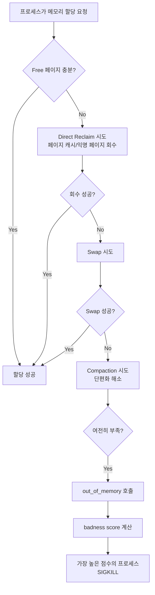
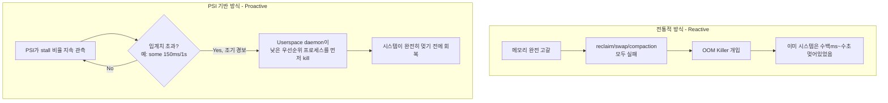

## OOM Killer 란 무엇인가

**OOM Killer(Out-Of-Memory Killer)** 는 리눅스 커널이 **더 이상 메모리를 회수할 방법이 없을 때** 강제로 프로세스를 종료시켜 시스템을 살리는 최후의 수단이다. 페이지 회수(reclaim), swap, 압축(compaction) 을 모두 시도했는데도 할당 요청을 만족시킬 메모리가 없으면, 커널은 `__alloc_pages_slowpath()` 내부에서 `out_of_memory()` 를 호출해 "누군가는 죽어야 시스템이 산다" 는 결정을 내린다.

이것은 사후 대응(reactive) 메커니즘이라는 점이 핵심이다. OOM Killer 가 개입하는 시점은 이미 시스템 전체가 메모리 할당 실패로 멎어 있는 상태다. 이 "너무 늦게 개입한다" 는 한계 때문에 등장한 것이 뒤에서 다룰 **PSI(Pressure Stall Information)** 다.

### 왜 커널이 프로세스를 강제로 죽여야 했나

리눅스는 기본적으로 **overcommit** 정책을 쓴다. `malloc()` 이 성공했다고 해서 그 메모리가 실제로 물리 메모리에 확보된 것이 아니다. 프로세스가 요청한 가상 주소 공간을 커널이 "일단 약속"하고, 실제 물리 페이지는 프로세스가 그 주소에 **write** 를 시도하는 순간(page fault) 에야 할당한다(lazy allocation). 이 정책이 없으면, fork() 로 자식 프로세스를 만들 때마다 부모의 전체 주소 공간만큼 물리 메모리를 예약해야 해서 비현실적이다.

문제는 overcommit 을 허용하면 "모든 프로세스가 동시에 약속받은 메모리를 실제로 다 쓰려는" 최악의 경우, 시스템이 물리적으로 감당할 수 없는 상황이 생긴다는 것이다. 이때 커널은 선택해야 한다: 새 할당 요청을 실패시킬 것인가(많은 유닉스 API 가 이 실패를 제대로 처리하지 못해 시스템이 불안정해진다), 아니면 누군가를 죽여서 메모리를 확보할 것인가. 리눅스는 후자를 택했다.



## Badness Score 와 oom_score_adj

커널은 `oom_badness()` 함수로 각 프로세스에 점수를 매기고, 가장 높은 점수를 받은 프로세스를 죽인다. 기본 공식은 대략 "프로세스가 사용 중인 실제 메모리(RSS) + swap 사용량 이 전체 가용 메모리에서 차지하는 비율" 이다. 즉 **메모리를 많이 먹는 프로세스일수록 먼저 죽는다**는 것이 기본 원칙이다.

이 점수는 `/proc/<pid>/oom_score_adj` 값으로 조정할 수 있다. 범위는 **-1000 ~ 1000** 이다.

| 값 | 의미 |
|---|---|
| `-1000` | OOM Killer 대상에서 완전히 제외 (`OOM_SCORE_ADJ_MIN`). 커널 자체 필수 프로세스 등에 사용 |
| `0` | 기본값. 순수하게 메모리 사용량으로만 평가 |
| `+1000` | 항상 최우선으로 죽는 후보 (`OOM_SCORE_ADJ_MAX`) |

```bash
# 특정 프로세스의 현재 OOM 점수와 조정값 확인
cat /proc/1234/oom_score       # 계산된 최종 badness score (0~1000)
cat /proc/1234/oom_score_adj   # 조정값 (-1000~1000)

# 중요한 데몬을 OOM 대상에서 제외
echo -1000 > /proc/1234/oom_score_adj

# 덜 중요한 백그라운드 작업의 우선순위를 높임 (먼저 죽도록)
echo 500 > /proc/1234/oom_score_adj
```

커널 관점에서 `oom_score_adj` 는 단순 가산값이 아니라, 최종 점수 계산에서 프로세스의 메모리 사용 비율에 이 값을 조정하는 방식으로 반영된다(`oom_badness()` 내부에서 `oom_score_adj` 를 total_vm 대비 percentage 로 환산해 더한다). 중요한 것은 이 값이 **어떤 프로세스가 죽어야 하는지에 대한 정책적 힌트**라는 점이다 — 커널은 메커니즘(누구를 죽일지 결정하고 실행하는 것)을 제공하고, 정책(무엇이 중요한지)은 userspace 가 `oom_score_adj` 를 통해 알려준다.

```c
// 커널 소스의 개념적 요약 (mm/oom_kill.c, 실제 구현은 버전마다 다름)
long oom_badness(struct task_struct *p, unsigned long totalpages) {
    long points;

    // OOM_SCORE_ADJ_MIN(-1000)이면 절대 죽이지 않음
    if (oom_unkillable_task(p))
        return LONG_MIN;

    // RSS + swap + page table 사용량 기반 기본 점수
    points = get_mm_rss(p->mm) + get_mm_counter(p->mm, MM_SWAPENTS);
    points += mm_pgtables_bytes(p->mm) / PAGE_SIZE;

    // oom_score_adj를 totalpages 대비 비율로 환산해 반영
    adj = (long)p->signal->oom_score_adj;
    points += totalpages * adj / 1000;

    return points;
}
```

## OOM Killer 의 한계: 왜 "이미 늦은" 개입인가

전통적 OOM Killer 의 근본적 문제는 **트리거 조건이 "완전한 고갈"** 이라는 것이다. 커널이 direct reclaim, swap, compaction 을 모두 시도하는 동안, 그 할당을 요청한 프로세스(그리고 종종 시스템 전체)는 이미 수백 ms ~ 수 초 동안 멈춰(stall) 있다. 사용자 입장에서는 화면이 얼어붙고, 터치에 반응이 없고, 서버라면 요청 타임아웃이 쌓인다. OOM Killer 가 실제로 프로세스를 죽이는 순간에는 이미 사용자 경험이 망가진 뒤다.

또한 "free memory 가 얼마나 남았는가" 라는 지표 자체가 압박 상태를 잘 설명하지 못한다. 페이지 캐시는 회수 가능하므로 free 가 적어도 문제없을 수 있고, 반대로 free 가 넉넉해 보여도 실제로는 reclaim/compaction 에 CPU 시간을 뺏겨 프로세스들이 계속 멈춰 있을 수 있다. **"메모리가 얼마나 남았는가" 와 "작업이 메모리 때문에 얼마나 기다리고 있는가" 는 다른 질문이다.**

## PSI(Pressure Stall Information): 사후 대응에서 선제 대응으로

**PSI(Pressure Stall Information)** 는 리눅스 **4.20(2018)** 에서 Facebook 엔지니어(Johannes Weiner)가 도입한 서브시스템이다. 핵심 아이디어는 free memory 같은 정적 스냅샷 대신, **태스크가 자원(메모리/CPU/IO) 부족으로 실행되지 못하고 얼마나 오래 정지(stall)했는지를 직접 측정**하는 것이다.

PSI 는 `/proc/pressure/{memory,cpu,io}` 로 노출되며, 각 자원마다 두 가지 지표를 제공한다.

- **`some`**: 최소 하나 이상의 태스크가 해당 자원을 기다리며 멈춘 시간의 비율(%)
- **`full`**: (memory, io 에서) 모든 non-idle 태스크가 동시에 멈춰서 CPU 가 사실상 유휴 상태가 된 시간의 비율(%) — 이 상태면 시스템 전체가 사실상 정지한 것과 같다

```bash
cat /proc/pressure/memory
# some avg10=0.02 avg60=0.05 avg300=0.01 total=1234567
# full avg10=0.00 avg60=0.00 avg300=0.00 total=0
```

`avg10/avg60/avg300` 은 각각 최근 10초/60초/300초 슬라이딩 윈도우의 평균 stall 비율이다. `total` 은 부팅 이후 누적 stall 시간(마이크로초)이다.



### Userspace 는 PSI 를 어떻게 소비하는가

PSI 파일은 단순히 읽는 것 외에, **쓰기 기반 트리거 등록**을 지원한다. 프로세스가 `/proc/pressure/memory` 에 임계치 문자열을 `write()` 하면, 커널은 그 fd 를 **`poll()`/`epoll()` 로 감시 가능한(POLLPRI) 상태**로 만들어, 임계치를 초과하는 순간 즉시 이벤트를 전달한다. 즉 userspace daemon 은 폴링 없이 이벤트 기반으로 압박 상태를 감지할 수 있다(자세한 이벤트 통지 메커니즘은 [[epoll-and-io-multiplexing|epoll]] 참고).

```c
// PSI 트리거 등록 및 감시의 개념적 흐름
int fd = open("/proc/pressure/memory", O_RDWR | O_NONBLOCK);

// "some 150000 1000000" = 1초(1,000,000us) 윈도우에서
// 150ms(150,000us) 이상 stall 발생 시 알림
write(fd, "some 150000 1000000", 20);

struct pollfd pfd = { .fd = fd, .events = POLLPRI };
while (1) {
    poll(&pfd, 1, -1);          // 임계치 초과할 때까지 블록
    if (pfd.revents & POLLPRI) {
        // 아직 OOM Killer가 개입하기 전 -- 여유가 있을 때
        // 우선순위가 낮은 프로세스를 선제적으로 종료
        kill_lowest_priority_process();
    }
}
```

이 패턴을 구현한 대표적인 userspace daemon:

- **systemd-oomd**(systemd 247+): cgroup 단위로 PSI 를 관찰하다가, 임계치를 초과하면 `oom_score_adj` 나 사용자 지정 우선순위에 따라 cgroup 전체를 선제적으로 종료한다.
- **earlyoom / oomd(Meta)**: 커널 OOM Killer 가 개입하기 훨씬 전에, 사용자 공간에서 자체 정책으로 프로세스를 죽이는 데몬. Meta 는 프로덕션 서버에서 커널 OOM Killer 의 응답 지연을 줄이기 위해 `oomd` 를 만들었다.
- **Android LMKD(Low Memory Killer Daemon)**: PSI 를 사용해 앱 프로세스를 선제적으로 종료하는 방식을 채택했다. 이는 이 문서에서 설명한 "reactive OOM Killer 의 한계를 PSI 기반 선제 대응으로 보완한다" 는 일반 패턴의 한 구현 사례다.

## 왜 두 메커니즘이 공존하는가

PSI 기반 userspace daemon 은 **정책적 유연성**(어떤 프로세스가 중요한지 세밀하게 판단 가능, 커널 재컴파일 없이 정책 변경 가능)을 제공하지만, 어디까지나 userspace 프로세스이므로 스케줄링 지연, 데몬 자체의 크래시, 극단적인 메모리 폭발(수 밀리초 만에 전체 메모리 소진) 상황에서는 제때 반응하지 못할 수 있다. 따라서 커널의 전통적 OOM Killer 는 **최후의 안전망(safety net)** 으로 항상 남아 있고, PSI 기반 daemon 은 그 앞단에서 대부분의 상황을 "부드럽게" 처리하는 역할 분담 구조다.

## 연결 문서

- [[kernel]] - 메모리 관리와 시스템 콜 전반에 대한 배경
- [[epoll-and-io-multiplexing]] - PSI 트리거 fd 를 감시하는 이벤트 통지 메커니즘
- [[virtual-memory]] - overcommit, 페이지 회수, swap 의 기반 개념
