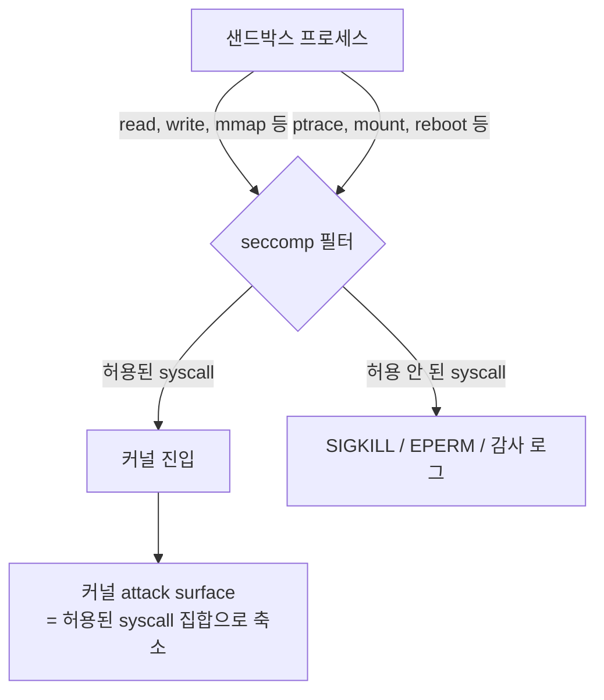
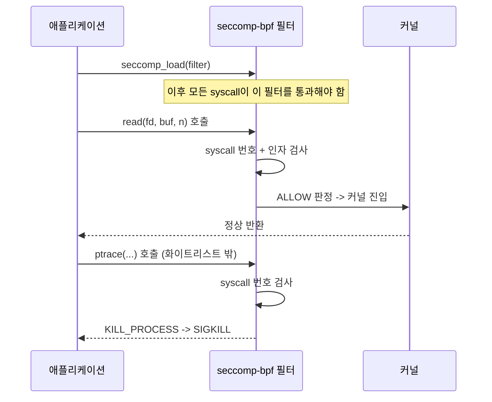

## seccomp 란 무엇인가

**seccomp(SECure COMPuting mode)** 는 리눅스 커널이 제공하는 보안 기능으로, **프로세스가 호출할 수 있는 시스템 콜의 종류를 화이트리스트(또는 블랙리스트)로 제한**한다. 일단 seccomp 필터가 걸린 프로세스는 허용되지 않은 시스템 콜을 시도하는 순간 커널에 의해 즉시 차단당한다 — 보통은 `SIGKILL` 로 프로세스가 죽거나, 에러 코드를 반환받거나, 감사 로그만 남긴다.

### 왜 시스템 콜 자체를 제한해야 하나

[[kernel|커널]] 문서에서 다뤘듯, 유저 모드 프로세스가 커널에 무언가를 요청하는 유일한 공식 경로는 **시스템 콜**이다. 즉 프로세스가 커널을 공격할 수 있는 표면(attack surface)은 정확히 "그 프로세스가 호출 가능한 시스템 콜들의 집합" 과 같다.

문제는 리눅스 커널이 노출하는 시스템 콜이 400개가 넘는다는 것이다. 대부분의 애플리케이션은 이 중 극히 일부(파일 읽기/쓰기, 메모리 할당, 소켓 통신 등 수십 개)만 사용한다. 나머지 수백 개 중 일부는 오래되고 잘 테스트되지 않은 코드 경로이며, 커널 취약점의 상당수는 바로 이런 "거의 안 쓰이는" 시스템 콜에서 발견된다. 웹 브라우저가 렌더링한 악성 JavaScript, 혹은 압축 해제 도중 조작된 아카이브 파일을 처리하는 프로세스처럼 **신뢰할 수 없는 입력을 처리하는 프로세스**가 커널 취약점을 트리거해 커널 권한을 획득(privilege escalation)하는 시나리오가 실제 공격에서 반복적으로 나타났다.

seccomp 의 아이디어는 단순하다: "이 프로세스는 어차피 `read`, `write`, `mmap`, `futex` 몇 개만 쓰니까, 나머지 수백 개 시스템 콜로 가는 문은 커널 레벨에서 아예 잠가버리자." 프로세스가 침투당하더라도, 공격자는 화이트리스트에 없는 시스템 콜을 통한 커널 익스플로잇을 시도할 수 없다.



## Strict Mode vs Filter Mode

seccomp 는 두 단계로 발전했다.

### 1. Strict Mode (Linux 2.6.12, 2005)

가장 초기 형태로, `prctl(PR_SET_SECCOMP, SECCOMP_MODE_STRICT)` 하나만 호출하면 이후 그 프로세스는 오직 **`read()`, `write()`, `_exit()`, 그리고 이미 열려 있는 파일 디스크립터에 대한 `sigreturn()`** 네 개만 사용할 수 있다. 매우 단순하지만 그만큼 유연성이 없다 — 새 파일을 열거나(`open`) 메모리를 추가로 매핑(`mmap`)하는 것조차 불가능하다. CPU 집약적 계산 작업을 미리 정해진 입출력 파이프로만 데이터를 주고받는 극단적으로 제한된 워커 프로세스 정도에나 쓸 수 있었다.

### 2. Filter Mode / seccomp-bpf (Linux 3.5, 2012)

Strict Mode 의 경직성을 해결하기 위해 구글 엔지니어들이 만든 확장이 **seccomp-bpf** 다. `prctl(PR_SET_SECCOMP, SECCOMP_MODE_FILTER, &prog)` 또는 `seccomp(2)` 시스템 콜로, **BPF(Berkeley Packet Filter) 바이트코드로 작성한 정책 프로그램**을 커널에 등록한다. 이 BPF 프로그램은 시스템 콜 번호와 인자(레지스터 값)를 검사해 각 호출마다 다음 중 하나의 판정을 내린다.

| 판정(action) | 동작 |
|---|---|
| `SECCOMP_RET_ALLOW` | 시스템 콜 실행 허용 |
| `SECCOMP_RET_ERRNO` | 실제로 호출하지 않고 지정된 errno 반환 (예: `EPERM`) |
| `SECCOMP_RET_TRAP` | `SIGSYS` 시그널 전달 (핸들러가 처리 가능) |
| `SECCOMP_RET_KILL_PROCESS` | 프로세스 전체를 즉시 종료 |
| `SECCOMP_RET_TRACE` | ptrace 트레이서에게 알림 (디버깅/감사용) |
| `SECCOMP_RET_LOG` | 허용은 하되 감사 로그에 기록 |

BPF 를 쓰는 이유는 **성능**과 **안전성** 둘 다다. eBPF 의 전신인 이 고전적 BPF 는 커널 내부 가상머신에서 실행되며, 루프가 없고 검증기(verifier)가 통과시킨 코드만 실행되므로 임의 코드 실행 위험 없이 매 시스템 콜마다 매우 빠르게(수십 ns 수준) 필터 로직을 평가할 수 있다.

### 필터 작성 예시 (libseccomp)

직접 BPF 바이트코드를 짜는 대신, 실무에서는 `libseccomp` 같은 고수준 라이브러리를 쓴다.

```c
#include <seccomp.h>

int main(void) {
    // 기본 동작: 화이트리스트에 없으면 SIGKILL로 프로세스 종료
    scmp_filter_ctx ctx = seccomp_init(SCMP_ACT_KILL_PROCESS);

    // 필요한 시스템 콜만 명시적으로 허용
    seccomp_rule_add(ctx, SCMP_ACT_ALLOW, SCMP_SYS(read), 0);
    seccomp_rule_add(ctx, SCMP_ACT_ALLOW, SCMP_SYS(write), 0);
    seccomp_rule_add(ctx, SCMP_ACT_ALLOW, SCMP_SYS(exit_group), 0);
    seccomp_rule_add(ctx, SCMP_ACT_ALLOW, SCMP_SYS(mmap), 0);
    seccomp_rule_add(ctx, SCMP_ACT_ALLOW, SCMP_SYS(futex), 0);

    // 인자 값까지 검사 가능: 예) open()을 O_RDONLY일 때만 허용
    seccomp_rule_add(ctx, SCMP_ACT_ALLOW, SCMP_SYS(open), 1,
                      SCMP_A1(SCMP_CMP_MASKED_EQ, O_ACCMODE, O_RDONLY));

    // 커널에 필터 프로그램 적재 -- 이 시점부터 정책이 즉시 적용됨
    seccomp_load(ctx);
    seccomp_release(ctx);

    // 이후 코드는 화이트리스트에 없는 syscall을 호출하면 즉시 죽는다
    do_untrusted_work();
    return 0;
}
```



### 되돌릴 수 없는 정책: 왜 한 방향으로만 좁아지나

seccomp 필터는 **한번 설치되면 완화(relax)할 수 없다**. 여러 필터를 중첩해서 설치할 수는 있지만, 새 필터는 기존 필터가 이미 거부한 것을 다시 허용할 수 없고 오직 더 제한적으로만 좁힐 수 있다(`no new privileges` 원칙과 함께). 이는 의도적인 설계다 — 만약 프로세스가 침투당한 뒤 공격자가 필터를 스스로 풀 수 있다면 애초에 방어 메커니즘으로서 의미가 없기 때문이다.

## 실제 사용 사례

- **Chrome/Chromium 샌드박스**: 렌더러 프로세스(신뢰할 수 없는 웹 콘텐츠를 파싱/실행하는 프로세스)는 seccomp-bpf 로 파일 열기, 네트워크 소켓 생성 같은 대부분의 시스템 콜이 막혀 있다. 실제 파일 I/O 나 네트워크 요청이 필요하면, 권한을 가진 별도의 브로커 프로세스에게 IPC 로 요청을 전달한다.
- **Docker 기본 seccomp 프로파일**: Docker 는 컨테이너를 실행할 때 기본적으로 약 40여 개의 시스템 콜(`reboot`, `mount`, `unshare`, `keyctl` 등 호스트 커널을 직접 건드리거나 네임스페이스 탈출에 악용될 수 있는 것들)을 차단하는 JSON 기반 seccomp 프로파일을 적용한다. `docker run --security-opt seccomp=custom.json` 으로 프로파일을 교체할 수 있다.
- **systemd 서비스**: `SystemCallFilter=` 지시어로 유닛 파일 단위에서 seccomp 화이트리스트를 선언적으로 설정할 수 있다.
- **gVisor, Firecracker 같은 컨테이너/VM 런타임**: 게스트 커널 호출을 가로채는 계층에서 seccomp 유사 필터링을 적극적으로 활용한다.

## 연결 문서

- [[kernel]] - 시스템 콜 메커니즘과 유저/커널 모드 전환 비용
- [[cpu-privilege-levels]] - seccomp 가 제한하는 "커널 모드로의 진입 경로" 의 배경
