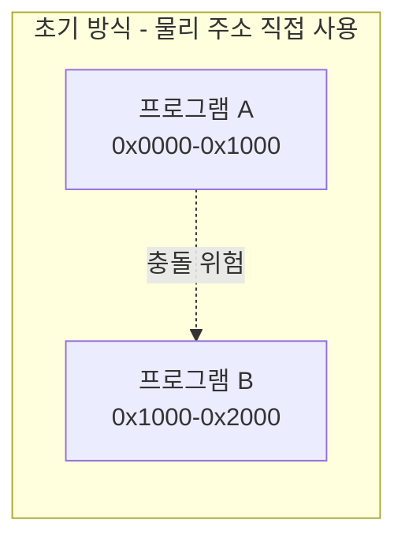
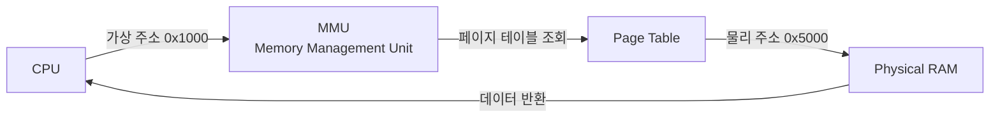
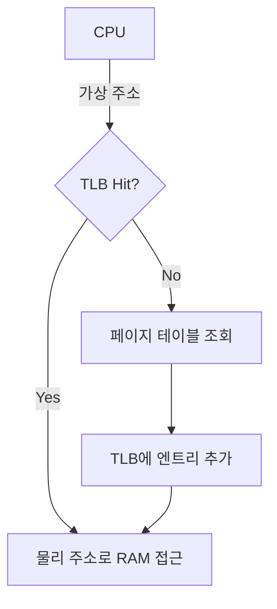
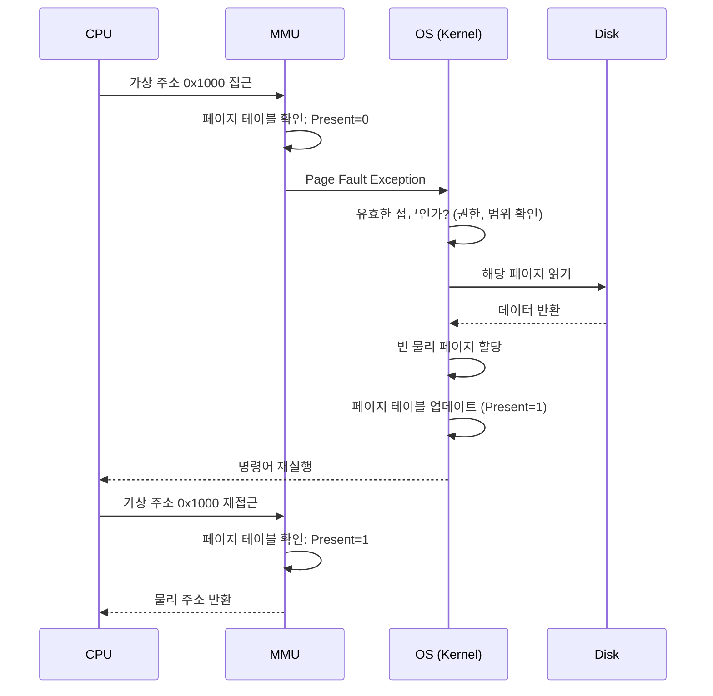
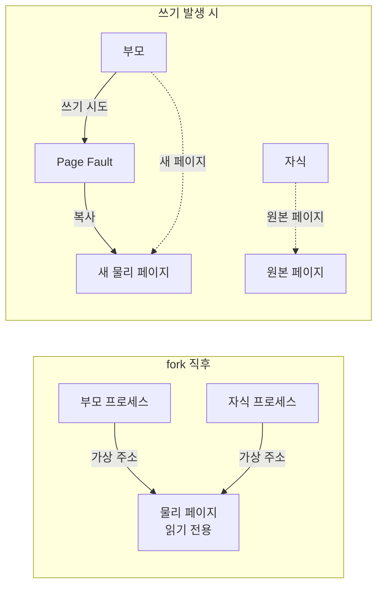

## 가상 메모리(Virtual Memory)란 무엇인가

가상 메모리는 **각 프로세스에게 독립된 주소 공간을 제공하는 메모리 관리 기법**이다. 프로그램은 마치 무한한 메모리를 독차지하는 것처럼 작동하지만, 실제로는 운영체제가 물리 메모리(RAM)를 여러 프로세스 간에 공유하고, 부족한 부분은 디스크로 확장한다.

### 가상 메모리가 필요하게 된 역사

#### 초기 컴퓨터의 메모리 관리

1950년대 초기 컴퓨터는 **물리 주소를 직접 사용**했다. 프로그램이 `0x1000` 주소에 접근하면, 실제 RAM의 `0x1000` 위치를 읽고 썼다.

**문제점**:

1. **메모리 부족**: 프로그램이 RAM보다 크면 실행 불가능. 32KB RAM에 64KB 프로그램은 로드할 수 없었다.
2. **격리 불가**: 프로그램 A가 프로그램 B의 메모리를 읽거나 덮어쓸 수 있었다. 버그나 악의적인 코드가 다른 프로그램이나 OS를 파괴할 수 있었다.
3. **재배치 문제**: 프로그램이 항상 같은 주소(예: `0x1000`)에서 시작해야 했다. 여러 프로그램을 메모리의 다른 위치에 로드하려면 코드를 수정해야 했다(relocation).



#### 1960년대: 페이징과 가상 메모리의 등장

**Atlas Computer**(1962, 맨체스터 대학)가 최초로 페이징을 구현했다. **Multics**(1965)와 IBM System/360 모델 67(1967)이 이를 발전시켰다.

핵심 아이디어:
1. **주소 변환**: 프로그램이 사용하는 주소(가상 주소)를 하드웨어(MMU)가 실제 메모리 주소(물리 주소)로 변환한다.
2. **페이지**: 메모리를 고정 크기(보통 4KB) 블록으로 나눈다.
3. **Demand Paging**: 필요한 페이지만 RAM에 로드. 나머지는 디스크에 보관하다가 접근 시 로드(page fault).

---

## 가상 메모리의 핵심 메커니즘

### 주소 변환

프로세스가 메모리를 읽을 때:



**예시**:
- 프로그램 A의 가상 주소 `0x1000` → 물리 주소 `0x5000`
- 프로그램 B의 가상 주소 `0x1000` → 물리 주소 `0x8000`

두 프로그램은 같은 가상 주소를 사용하지만, 실제로는 다른 물리 메모리를 가리킨다. **완벽한 격리**.

### 페이지 테이블(Page Table)

가상 주소를 물리 주소로 매핑하는 자료구조. 커널이 각 프로세스마다 유지한다.

```
가상 페이지 번호 → 물리 페이지 번호

예시 (4KB 페이지):
가상 주소 0x1000 (페이지 1) → 물리 주소 0x5000 (페이지 5)
가상 주소 0x2000 (페이지 2) → 물리 주소 0x3000 (페이지 3)
```

**페이지 테이블 엔트리(PTE)** 구조:
- **물리 페이지 번호**: RAM의 어디에 있는가.
- **Present Bit**: RAM에 있는가, 아니면 디스크에 있는가.
- **Read/Write Bit**: 읽기 전용인가, 쓰기 가능한가.
- **User/Supervisor Bit**: 유저 모드에서 접근 가능한가.
- **Dirty Bit**: 페이지가 수정되었는가(디스크와 동기화 필요).
- **Accessed Bit**: 최근에 접근되었는가(교체 알고리즘에 사용).

### 가상 주소 공간 레이아웃

프로세스는 독립된 가상 주소 공간을 가진다. Linux x86-64 기준:

```mermaid
graph TB
    subgraph 가상 주소 공간 (64-bit)
        Kernel[커널 공간<br/>0xFFFF800000000000~<br/>모든 프로세스 공유]
        Stack[스택<br/>아래로 성장<br/>0x7FFFFFFFFFFF]
        Heap[힙<br/>위로 성장<br/>malloc/new]
        BSS[.bss<br/>초기화 안 된 전역 변수]
        Data[.data<br/>초기화된 전역 변수]
        Text[.text<br/>프로그램 코드<br/>0x400000]
    end
    
    Text --> Data
    Data --> BSS
    BSS --> Heap
    Heap -.여유 공간.-> Stack
    Stack --> Kernel
```

**장점**:
- 스택과 힙이 충돌 없이 성장 가능.
- 코드 영역은 읽기 전용으로 보호 가능.
- ASLR로 주소를 랜덤화해 보안 강화.

---

## 페이징(Paging)

### 왜 고정 크기 페이지인가?

초기에는 **세그먼테이션(Segmentation)**을 사용했다. 프로그램을 논리적 단위(코드, 데이터, 스택)로 나누고, 각 세그먼트를 연속된 메모리에 할당했다.

**문제: 외부 단편화(External Fragmentation)**

```
메모리 상태:
[사용 중 10KB] [빈 공간 5KB] [사용 중 20KB] [빈 공간 3KB]

새 프로그램 8KB 필요 → 전체 빈 공간은 8KB이지만, 연속되지 않아 로드 불가
```

**페이징 해결책**:
- 고정 크기(4KB)로 나누면, 어디든 자유로운 페이지에 할당 가능.
- 외부 단편화 해결. 대신 **내부 단편화**(프로그램이 페이지를 다 채우지 못함)는 최대 4KB-1B로 제한적.

### 페이지 크기 선택

| 페이지 크기 | 장점 | 단점 |
|-------------|------|------|
| **작은 페이지 (4KB)** | 내부 단편화 최소화<br/>세밀한 권한 제어 | 페이지 테이블 크기 증가<br/>TLB 미스 빈번 |
| **큰 페이지 (2MB, 1GB)** | TLB 효율 향상<br/>페이지 테이블 작음 | 내부 단편화 증가<br/>메모리 낭비 |

**Huge Pages**: 데이터베이스나 가상화처럼 메모리를 많이 쓰는 애플리케이션은 큰 페이지를 사용해 TLB 미스를 줄인다.

```bash
# Linux에서 Huge Pages 활성화
echo 512 > /proc/sys/vm/nr_hugepages  # 2MB 페이지 512개 예약
```

### TLB(Translation Lookaside Buffer)

페이지 테이블은 메모리에 있다. 주소 변환마다 메모리 접근 2회(페이지 테이블 읽기 + 실제 데이터 읽기) → 성능 저하.

**TLB**는 최근 변환된 주소를 캐싱하는 하드웨어 [[buffer|버퍼]]다.



**TLB 미스**: 캐시에 없으면 페이지 테이블을 조회해야 함. 컨텍스트 스위칭 시 TLB를 플러시하면(다른 프로세스의 주소 공간), 성능 저하.

**최적화**: ASID(Address Space ID)로 프로세스별 TLB 엔트리 구분 → 플러시 불필요.

---

## Demand Paging과 Page Fault

### Demand Paging

프로그램 실행 시 모든 코드를 메모리에 로드하지 않는다. **실제로 접근할 때**(on-demand) 페이지를 로드한다.

**이유**:
- 프로그램은 모든 코드를 실행하지 않는다(에러 처리, 드물게 쓰는 기능).
- **지역성(Locality)**: 코드와 데이터는 시간적/공간적으로 인접한 부분을 반복 사용.
- 메모리 절약.

**프로세스 시작**:
1. `exec()` 시스템 콜로 프로그램 로드.
2. 페이지 테이블 생성, 모든 페이지를 "Present=0"(디스크에 있음)으로 표시.
3. 첫 명령어 실행 시도 → **Page Fault** 발생.
4. OS가 해당 페이지를 디스크에서 읽어 RAM에 로드.
5. 페이지 테이블 업데이트, 명령어 재실행.

### Page Fault 처리 과정



**잘못된 접근 시**:
- 범위 밖 주소 → **Segmentation Fault** (SIGSEGV 시그널).
- 쓰기 금지 페이지에 쓰기 → 프로세스 종료.

---

## 페이지 교체(Page Replacement)

RAM이 가득 차면, 새 페이지를 로드하기 위해 기존 페이지를 **디스크로 내보내야(swap out)** 한다.

### 어떤 페이지를 내보낼까?

**최적 알고리즘(OPT)**: 미래에 가장 오래 사용되지 않을 페이지. 하지만 미래를 알 수 없다.

**실용적 알고리즘**:

#### 1. FIFO (First-In-First-Out)
가장 오래 전에 로드된 페이지를 교체. 단순하지만 비효율적.

**문제**: 자주 사용하는 페이지(예: 라이브러리 코드)도 오래되면 교체됨.

#### 2. LRU (Least Recently Used)
가장 오랫동안 사용되지 않은 페이지를 교체.

**구현**: Accessed Bit 사용. 주기적으로 clear하고, 다음 주기에도 0이면 교체 후보.


#### 3. Clock (Second Chance)
FIFO + Accessed Bit. 순환 리스트를 돌며, Accessed=1이면 0으로 바꾸고 넘어감. Accessed=0인 페이지 발견 시 교체.

**Linux는 복잡한 변형 사용**:
- **Active/Inactive 리스트**: 최근 사용 여부로 분류.
- **File-backed vs Anonymous**: 파일은 디스크에 원본 있으므로 dirty면 쓰고 회수. Anonymous(힙, 스택)는 swap 필요.

### Swap 공간

페이지를 내보낼 디스크 영역. Linux는 swap 파티션 또는 swap 파일 사용.

```bash
# swap 확인
swapon --show

# swap 파일 생성
fallocate -l 4G /swapfile
mkswap /swapfile
swapon /swapfile
```

**Swappiness**: 얼마나 적극적으로 swap할지.

```bash
cat /proc/sys/vm/swappiness  # 0~100, 기본 60
# 높음: 메모리 부족 전에 미리 swap
# 낮음: 최대한 RAM 사용
```

---

## Copy-on-Write (COW)

### fork()의 문제

프로세스가 `fork()`하면 자식 프로세스가 생성된다. 초기 구현은 부모의 메모리를 **전부 복사**했다.

**비효율**:
- 프로세스가 100MB 메모리 사용 → 복사에 수십 밀리초 소요.
- `fork()` 직후 `exec()`를 호출하면, 복사한 메모리는 즉시 버려진다(새 프로그램 로드).

### COW 메커니즘

부모와 자식이 **같은 물리 페이지를 공유**한다. 페이지 테이블 엔트리를 "읽기 전용"으로 표시.



**동작**:
1. `fork()` 즉시 반환(복사 없음).
2. 부모 또는 자식이 메모리를 **쓰려고 시도** → Page Fault.
3. OS가 페이지를 복사하고, 쓰는 쪽에 새 페이지 할당.
4. 읽기만 하는 페이지는 계속 공유.

**이점**:
- `fork()` 속도 극적 향상.
- 메모리 절약(공유 라이브러리는 수백 개 프로세스가 공유).

---

## 공유 메모리

### mmap()을 통한 파일 매핑

파일을 메모리처럼 읽고 쓸 수 있다.

```c
int fd = open("data.txt", O_RDWR);
char *map = mmap(NULL, filesize, PROT_READ | PROT_WRITE, MAP_SHARED, fd, 0);
map[0] = 'A';  // 파일의 첫 바이트를 'A'로 수정
munmap(map, filesize);
```

**동작**:
1. `mmap()` 호출 시 페이지 테이블 엔트리만 생성, 페이지는 로드 안 함.
2. `map[0]` 접근 → Page Fault.
3. OS가 파일의 해당 부분을 읽어 RAM에 로드.
4. 이후 접근은 메모리 속도로 진행.
5. Dirty 페이지는 주기적으로 또는 `munmap()` 시 파일에 기록.

**장점**:
- `read()`/`write()` 시스템 콜 오버헤드 제거.
- 커널의 페이지 캐시 활용.
- 큰 파일도 부분적으로만 로드.

### 프로세스 간 공유 메모리

여러 프로세스가 같은 물리 페이지를 매핑해 데이터를 공유.

```c
// POSIX 공유 메모리
int shm_fd = shm_open("/my_shm", O_CREAT | O_RDWR, 0666);
ftruncate(shm_fd, SIZE);
void *ptr = mmap(NULL, SIZE, PROT_READ | PROT_WRITE, MAP_SHARED, shm_fd, 0);
```

프로세스 A와 B가 같은 `/my_shm`을 매핑하면, 같은 물리 메모리를 공유.

**사용처**: 데이터베이스(공유 버퍼 풀), 그래픽(프레임 버퍼 공유).

---

## 메모리 보호

### 권한 비트

페이지 테이블 엔트리의 권한 비트로 접근 제어:

- **Read**: 읽기 가능.
- **Write**: 쓰기 가능.
- **Execute**: 코드 실행 가능.

**NX/DEP(Data Execution Prevention)**:
- 스택과 힙을 "실행 불가"로 표시.
- 버퍼 오버플로우로 스택에 쉘코드를 삽입해도 실행 불가.

```c
// 코드 영역: Read + Execute
mprotect(code_page, size, PROT_READ | PROT_EXEC);

// 스택: Read + Write (Execute 제외)
mprotect(stack_page, size, PROT_READ | PROT_WRITE);
```

### 커널/유저 모드 분리

**User Bit**: 페이지가 유저 모드에서 접근 가능한지.

- 커널 메모리는 User=0 → 유저 프로그램이 접근 시 Page Fault.
- 시스템 콜로 커널 모드 진입 시에만 접근 가능.

**Meltdown 취약점**: 일부 CPU는 추측 실행(speculative execution)으로 권한 검사 전에 커널 메모리를 읽어 캐시에 저장. 사이드 채널 공격으로 데이터 유출. KPTI(Kernel Page Table Isolation) 패치로 완화.

---

## 가상 메모리의 성능 최적화

### Prefetching

Page Fault가 발생하면, 인접 페이지도 미리 로드(공간적 지역성 활용).

```
페이지 10 요청 → 페이지 9, 10, 11 함께 로드
```

### Transparent Huge Pages (THP)

커널이 자동으로 작은 페이지(4KB)를 큰 페이지(2MB)로 합친다. TLB 효율 향상.

```bash
cat /sys/kernel/mm/transparent_hugepage/enabled
# [always] madvise never
```

**주의**: 메모리 단편화 증가, Latency spike(페이지 합치는 동안) 가능.

### NUMA(Non-Uniform Memory Access)

멀티 소켓 서버는 각 CPU마다 로컬 메모리가 있다. 원격 메모리 접근은 느리다.

```bash
numactl --cpunodebind=0 --membind=0 ./my_program
# CPU 0과 메모리 노드 0에 고정
```

---

## 안드로이드의 가상 메모리 활용

### zRAM

물리 메모리의 일부를 압축 swap 공간으로 사용. [[android-kernel#zRAM|안드로이드 커널의 zRAM]] 참고.

### LMKD와 메모리 회수

메모리 부족 시 백그라운드 앱을 종료해 메모리 확보. [[android-kernel#4 LMKD 선제적 프로세스 종료|LMKD]] 참고.

### ION/DMABuf

GPU, Camera 같은 하드웨어가 접근하는 메모리는 물리적으로 연속되거나 특수한 속성 필요. [[android-kernel#ION → DMABuf Heaps|DMABuf]] 참고.

---

## 디버깅과 모니터링

### /proc/<pid>/maps

프로세스의 메모리 맵 확인:

```bash
cat /proc/self/maps
```

출력 예:
```
400000-401000 r-xp 00000000 08:01 123456  /bin/bash  # 코드
600000-601000 r--p 00001000 08:01 123456  /bin/bash  # 읽기 전용 데이터
601000-602000 rw-p 00002000 08:01 123456  /bin/bash  # 읽기/쓰기 데이터
7ffff7a00000-7ffff7bcd000 r-xp 00000000 08:01 234567  /lib/libc.so  # 공유 라이브러리
7ffffffde000-7ffffffff000 rw-p 00000000 00:00 0  [stack]  # 스택
```

- `r-xp`: Read, Execute, Private
- `rw-p`: Read, Write, Private

### vmstat

메모리 통계:

```bash
vmstat 1
# si: swap in (디스크→RAM)
# so: swap out (RAM→디스크)
```

si/so가 지속적으로 높으면 **thrashing**(페이지 교체가 과도해 성능 급락).

### perf

Page Fault 빈도 측정:

```bash
perf stat -e page-faults ./my_program
```

---

## 가상 메모리의 트레이드오프

### 장점
- **격리**: 프로세스 간 메모리 보호.
- **유연성**: 프로그램이 큰 주소 공간 사용 가능.
- **효율성**: 물리 메모리보다 큰 프로그램 실행.

### 단점
- **오버헤드**: 주소 변환, TLB 미스, Page Fault 처리 비용.
- **복잡성**: 페이지 교체 알고리즘, 메모리 단편화 관리.
- **Thrashing**: 메모리 부족 시 성능 급락.

---

## 학습 리소스

**책**:
- *Operating System Concepts* (Silberschatz): 가상 메모리 이론.
- *Understanding the Linux Virtual Memory Manager* (Gorman): Linux 구현 상세.

**온라인**:
- [Linux mm Documentation](https://www.kernel.org/doc/html/latest/admin-guide/mm/index.html)
- [What Every Programmer Should Know About Memory](https://people.freebsd.org/~lstewart/articles/cpumemory.pdf)

---

## 연결 문서

[[kernel]] - 커널의 메모리 관리 서브시스템  
[[android-kernel]] - 안드로이드의 메모리 최적화(zRAM, LMKD)  
[[buffer]] - 버퍼와 메모리 활용
