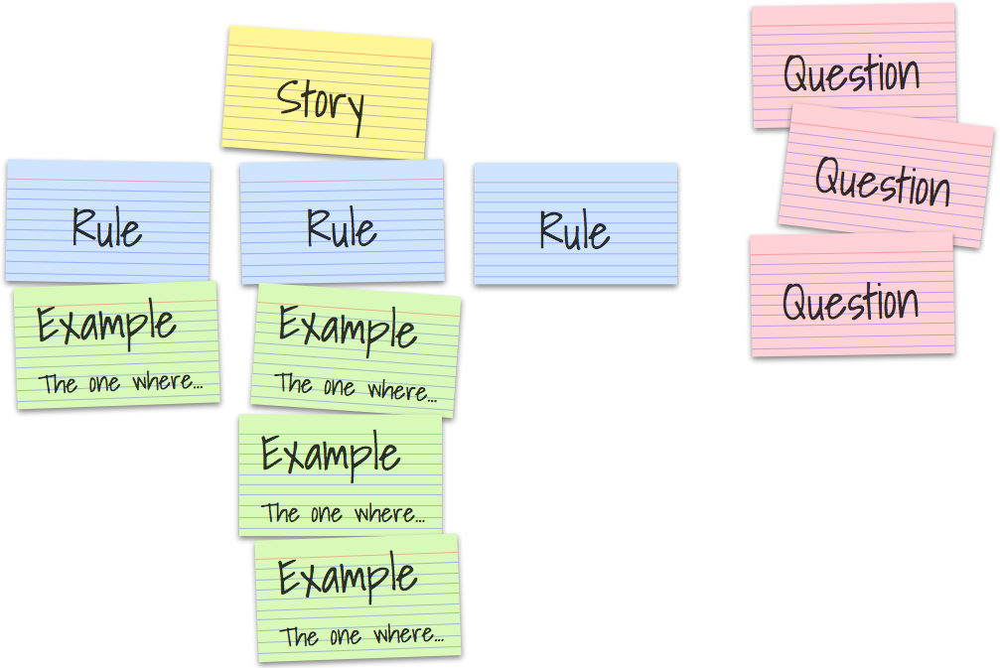
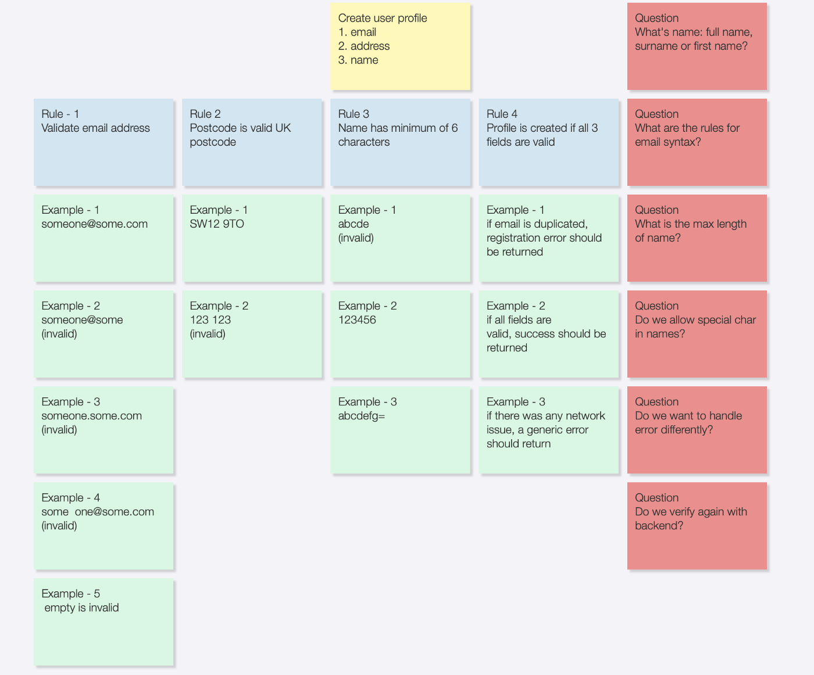

## 프로세스

### 🔍Discovery

- discovery 를 하지 않고는 적절한 BDD 를 하기 힘듬
- Product Owner 와 team 은 story 를 정리하고, 개발 혹은 배포 이후에 문제가 될 만한 사항을 모은다
- session 이 길어질 수 있는데, 이것은 전혀 잘못된 것이 아니고 오히려 잘되고 있는 것이라고 함

| Typical project         | BDD project                |
| ----------------------- | -------------------------- |
| PO creates user stories | PO creates user stories    |
| Explain it to engineers | Discovery and refinement   |
| QA estimates test cycle | QA and dev write scenarios |

### 🗒️Backlog

- developer 가 Sprint N 에서 작업 중일 때, Product Owner 와 business analyst 는 Sprint N+1 의 story 를 backlog 에 작성하는 것
  - story 들은 기능 관점과 UAC(User Acceptance Criteria) 관점에서 채워져야 함
- discovery workshop 에서 이 backlog 들은 BDD scenario 로 활용될 것임

```markdown
- 예시

+--------+---------------------------------------------------------+
| Scope  | as a user                                               |
|        | I want to enter personal details                        |
|        | so I can create a profile                               |
+--------+---------------------------------------------------------+
| UAC    | When a user login, then the user is shown profile screen|
|        | When a user clicks edit, the user is shown edit screen  |
|        | When a user enters email, the app validates its format  |
+--------+---------------------------------------------------------+
```

### 🌎Example mapping

- Sprint 동안 3 Amigos(Product Owner, Dev, Tester) 는 meeting 을 진행하여 다음 수행하여 다음 sprint 를 준비
  - refinement
  - backlog
  - grooming
  - event storming
- 목표는 User Acceptance Criteria 를 clean, thorough 한 Gherkin scenario 로 만드는 것
  - PO 는 어느 방향으로 갈지 정함
  - Tester 는 edge case 를 추가
  - Dev 는 디테일 추가
- Example Mapping 방법을 이용하여 효과적으로 보일수 있게 할 수 있음
  - [Introduction to BDD Example Mapping | Cucumber Blog](https://cucumber.io/blog/bdd/example-mapping-introduction/)





1. A Story
    - 여러개의 rule 을 가지고 있다
    - 하지만 너무 많다면 story 가 너무 큰 것을 의미한다
        - 여러개의 story 로 쪼개야 한다
2. A Rule
    - example 을 요약한다
    - 너무 많은 example 이 있다면 rule 이 너무 복잡하다는 것을 의미한다
3. Questions
    - 더 깊은 대화로 이끌어주는 역할을 한다
    - 너무 많은 red card 들이 있다면 story 가 아직 준비되지 않은 것을 의미한다

### 🥒Gherkin

- example mapping 에 따라서, Dev 와 Tester 는 가끔 만나서 Gherkin scenario 를 만듬

1. Scenario
    - example mapping 의 business rule
2. Given
    - example mapping 에 포함되지 않지만 미리 준비되어야 하는 환경
3. When
    - 어떤 action 이 수행될 때
4. Then
    - 기대되는 동작

| Scenario | create user profile with valid inputs |
| -------- | ------------------------------------- |
| Given    | user supplies email postcode and name |
| When     | all fields are valid                  |
| Then     | assert the expected behavior          |

BDD 는 Unit 테스트나 UI 테스트가 아님

| UI test               | Acceptance Test         | Unit Test       |
| --------------------- | ----------------------- | --------------- |
| The button is enabled | Able to create playlist | Date formatting |
| Margin is 10px        | Able to make payment    | Add number      |
