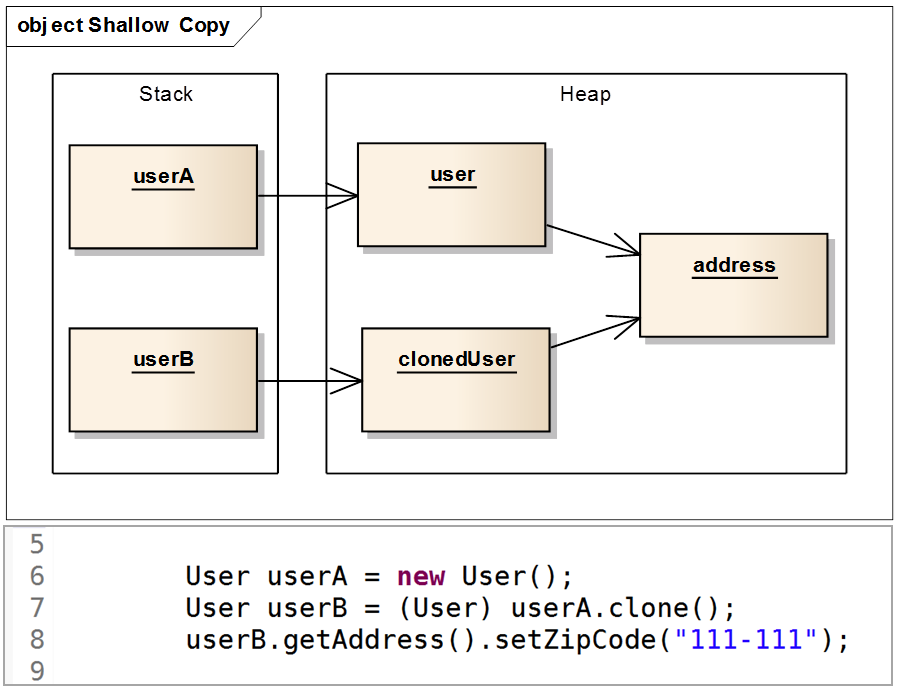

## UML

- Unified Modeling Language
- OMG(Object Management Group) 에서 표준으로 채택한 통합모델링 언어
- 모델을 만드는 표준언어
  - 모델?
  - 어떤 것을 실제로 만들 때 이렇게 만들면 잘 작동할지 미리 검증해보는 것
  - 실제 물건을 만드는 비용보다 비용이 훨씬 적을 경우에 모델을 만들어 설계 검사
- 건축, 항공 등의 모델과 다른면이 있음
  - 건물을 짓고, 항공기를 만드는 것과 설계, 만드는 비용의 차이가 큼
- UML 다이그램을 그리며 모델을 만드는 일은 개발보다 비용이 적긴 하지만 훨씬 적게 드는 것이 아니며 때로는 개발보다 비용이 많이 들 수도 있음
- 그래서 UML 은 시험해볼 구체적인 것이 있고, 그것을 코드로 시험해 보는 것보다 UML 로 시험해보는 쪽이 비용이 덜 들 때 주로 사용
  - 비용이 덜 들어 사용하는 유형 3 가지
    1. 다른 사람들과의 의사소통 또는 설계 논의
    2. 전체 시스템의 구조 및 클래스의 의존성 파악
    3. 유지보수를 위한 설계의 back-end 문서
- 습관적으로 만드는 것이 아니라 필요에 의해 만드는 것이 가장 좋음
- 종류
    1. 구조 다이어그램 (7 가지)
        - 시스템의 개념, 관계 등의 측면에서 요소들을 나타내고 각 요소들의 정적인 면을 보기 위한 다이어그램
    2. 행위 다이어그램 (7 가지)
        - 각 요소들 혹은 요소들간의 변화나 흐름, 주고 받는 데이터 등의 동작을 보기 위한 다이어그램

- 목적에 따라 다르게 사용됨

1. 개념차원의 UML
    - 문제 도메인의 구조를 나타내며 사람이 풀고자 하는 문제 도메인 안에 있는 개념과 추상적 개념을 기술하기 위한 것
    - 소스코드와 관계가 깊지 않고 오히려 사람의 자연언어와 더 관련되어 있음
    - 의미론적 (언어의 뜻을 규정하는) 규칙에 그다지 얽매이지 않으며, 따라서 의미하는 바도 모호하거나 해석에 따라 달라질 수 있음
2. 명세/구현 차원의 UML
    - 소프트웨어의 설계 혹은 완성된 소프트웨어의 구현 설명 목적 등으로 사용하며 설계를 해서 소스코드로 바꾸거나 구현 된 소스코드를 설명하려고 사용
    - 소스코드와 관계가 깊음
    - 이 두 차원의 클래스 다이어그램은 제약이 많아서 반드시 일정한 규칙과 의미론을 지켜야 함
    - 모호성이 거의 없도록 하고 형식도 최대한 맞춰야함

## Class Diagram(클래스 다이어그램)

- 구조 다이어그램
- 클래스 내부의 정적인 내용이나 클래스 사이의 관계를 표기하는 다이어그램
- 시스템의 일부 또는 전체 구조를 나타낼 수 있음
- 의존관계를 명확히 보게 해주며, 순환 의존이 발생하는 지점을 찾아내서 어떻게 이 순환 고리를 깨는 것이 가장 좋은지 결정할 수 있게 해줌

### 클래스 다이어그램의 요소 (Element)

#### 1. Class(클래스)

- 보통 3 개의 compartment(구획) 으로 나누어 클래스 이름, 속성, 기능을 표기
- 속성과 기능은 옵션으로 생략이 가능하지만, 이름은 필수로 명시해야 함
- 세부사항에는 필드와 메서드의 Access modifier(접근 제한자), 필드명 (메서드 명), 데이터 타입, parameter(매개변수), 리턴 타입 등을 나타낼 수 잇음
  - 세부사항을 자세하기 적는 것이 유용할 때도 있지만, 다이어그램을 그리는 목적에 필요한 것만 사용하는 것이 좋음
- 3 개의 compartment 를 사용하지만 다른 미리 정의되거나 사용자 정의 된 모델 속성 (비즈니스 룰, 책임, 처리 이벤트, 발생된 예외 등) 을 나타내기 위한 추가 구획도 사용할 수 있음

#### 2. Stereo Type(스테레오 타입)

- UML 에서 제공하는 기본 요소 외에 추가적인 확장요소를 나타내는 것
- 쌍 꺾쇠 보다 작은 guillemet(<< >>) 에 요소 이름을 적음
- 밑줄은 static, {readOnly}는 final 키워드를 의미
- 많이 사용되는 예시
  - `<<interface>>`, `<<utility>>`, `<<abstract>>`, `<<enumeration>>`

#### 3. Abstract Class(추상 클래스)

- 1 개 이상의 메서드가 구현체가 없고 명세만 존재하는 클래스
- italic 체나 {abstract} 프로퍼티를 사용하여 표기함
  - 수기 표시할 때는 italic 체 보다 {abstract}로 표현하는 것이 구분하기 쉬움
- (공식적인것 아님) 스테레오타입을 사용하여 추상클래스 표기하기도 함

### 클래스간의 관계

- 클래스 다이어그램의 주목적은 클래스간의 관계를 한눈에 쉽게 보고 의존 관계를 파악하는 것에 있음

    ⇒ 클래스간의 관계를 명확하게 표시하는 것이 중요

- 많이 사용되는 것 위주로 표시

#### 일반화 (Generalization)

- 상속 관계를 의미

#### 실체화 (Realization)

- 구현 관계를 의미

#### 의존 (Dependency)

- 클래스 다이어그램에서 일반적으로 제일 많이 사용되는 관계
- 어떤 클래스가 다른 클래스를 참조

- 참조의 형태
  - 메서드 내에서 대상 클래스의 객체 생성
  - 메서드 내에서 대상 클래스의 객체 사용
  - 메서드 내에서 대상 클래스의 메소드 호출
  - 매개변수로 해당 객체 받기

#### 연관 (Association), 방향성 있는 연관 (Directed Association)

- 보통 다른 객체의 참조를 가지는 필드를 의미

- *: multiplicity. 즉 가질 수 있는 갯수를 나타냄
  - 0…*, 1…*, 1…2 등 다양하게 표현 가능
- 2 번 다이어그램 처럼 방향성을 표현하지 않으면 의미가 여러가지 일 수 있음
- 3 번 다이어그램과 동일한 의미의 다이어그램

- 클래스의 속성이 기본 제공 클래스가 아니거나 중요 또는 강조하고 싶을 때 나타내는 다이어그램

#### 집합 (Aggregation)

- Composition 과 함께 Association 관계를 조금 더 특수하게 나타낸 것
- 전체 (Whole) 와 부분 (Part) 의 관계를 가짐

- Association 과 크게 다르지 않기 때문에 사용하지 않는 것이 좋음

#### 합성 (Composition)

- Aggregation 과 비슷하게 whole(전체) 와 part(부분) 의 집합 관계를 나타내지만 개념적으로 Aggregation 보다 더 강한 집합을 의미

- part 가 whole 에 종속적이어서 part 가 whole 의 소유 관계임
  - Aggregation 은 part 가 whole 에 독립적이어서 whole 이 part 를 빌려 쓰는 의미
  - part 를 가지는 whole 인스턴스가 part 인스턴스의 전체 수명을 책임
  - part 에 해당하는 인스턴스는 공유될 수 없음

- user 만 복사 되었고 address 는 복사되지 않음 ⇒ shallow copy
- 조건에 충족하지 못함

- user 복사와 함께 address 도 같이 복사되므로 composition 에 맞음
