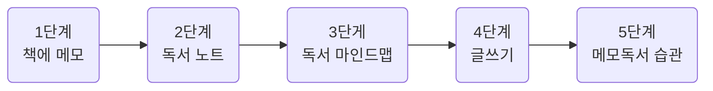

## 1. 메모 독서가 남는 독서다
- 메모 독서는 메모하며 책을 읽는 방법입니다
	- 메모는 잊지 않기 위해 간략하게 적는 것만을 의미하는 것이 아닙니다
		- 넓은 의미로 책과 관련되어 무언가를 쓰는 행위 전체를 말합니다
		- 책의 여백에 간단히 메모하는 것뿐만 아니라, 독서 노트에 책의 문장을 옮겨 적고, 책을 읽은 다음에 서평을 쓰는 것까지 책과 관련된 모든 '쓰는' 활동 모두를 포함
	- 쓰면서 책의 내용을 음미하고, 생각하며 읽는다는 것이 중요합니다
	- 책이 하는 말에 경청하고, 나 자신의 생각에 경청하는 겸손한 독서법입니다
	- 책의 메모 독서법

1. 책에 메모하기
	- 밑줄을 친다
	- 색을 달리하여 중요도를 분류한다
	- 책의 여백에 질문하고, 답을 찾는다
2. 독서 노트 쓰기
	- 중요한 문장, 기억하고 싶은 문장을 필사한다
	- 떠오르는 생각과 질문을 적는다
	- 독서 노트를 다시 읽는다
3. 독서 마인드맵 작성하기
	- 키워드를 뽑는다
	- 범주화를 통해 계층형 목록을 만든다
	- 색상이나 기호로 강조 표시한다
4. 메모 독서로 글쓰기
	- 질문을 찾는다
	- 핵심문장을 쓴다
	- 글의 설계도를 그린다
5. 메모 독서 습관 만들기
	- 규칙적으로 읽는 습관을 들인다
	- 독서 모임에 참여한다
	- 완벽하게 쓰려고 하지 않는다

- 메모 독서를 하면 시간이 많이 걸려 책을 더 적게 읽을 것 같지만 실제로는 그렇지 않습니다. 메모 독서를 통해 깊이 읽기의 맛을 보게 되면 독서가 더 재미있어지기 때문입니다
- 사람들이 책을 읽지 않는 이유는 ~ 독서의 효과를 체험하지 못했기 때문에 책을 읽으려는 동기가 생기지 않은 것이죠. 왜 독서 효과를 체험하지 못하는 것일까요?
	1. 기억하지 못한다
	2. 생각하지 않는다
	3. 글을 쓰지 않는다
	4. 행동하지 않는다
	5. 무언가를 만들지 않는다
- '효과 없는 독서'를 만드는 다섯가지 원인은 다음과 같이 메모 독서를 통해 해결할 수 있습니다
	1. 오래 기억한다
	2. 생각하는 독서를 한다
	3. 글을 쓰게 된다
	4. 행동을 이끈다
	5. 창조적인 일을 한다
- 메모 독서를 시작하기 전에 준비물 챙기기
	1. 메모 독서를 하며 읽을 책 한 권
		- 처음 할 때는 재미있어 보이는 책을 선택하는 것이 좋습니다
	2. 독서 노트
		- 아날로그 방식으로 독서 노트를 쓰며 감을 잡은 뒤 그 다음에 디지털 방식을 시도해 자신에게 더 적합한 것으로 결정하면 됩니다
	3. 필기구
		- 형광펜, 색연필, 다색 볼펜, 연필 등 어떤 필기구라도 좋습니다
	4. 포스트잇 플래그
		- 중요 부분에 붙여두면 책을 덮은 상태에서도 보이기 때문에 바로 찾아 확인할 수 있습니다
		- 플래그 위에 글씨를 쓸 수 있는 제품도 있어 키워드를 적어두면 책에서 필요한 내용을 빠르게 찾을 수 있습니다
---
## 2. 독서에 메모를 더하다
- 책을 깨끗하게 보면 깨끗하게 잊힙니다
	- 메모 독서는 시간을 레버리지 하는 가장 좋은 방법입니다
- 밑줄 치기는 책 내용중에서 중요한 것, 나에게 필요한 것을 선별하는 중요한 작업입니다
	- 밑줄 치기는 나 자신의 정체성과 성장을 확인하는 과정이기도 합니다
		- 다시 Rereading을 하며 과거의 내가 공감했던 문장들을 살펴보면서 내가 어떤 사람인지 다시 확인하는 것이죠
	- 저는 책을 다시 읽을 때 처음 읽을 때 사용했던 것과 다른 색의 형광펜으로 밑줄을 칩니다.
		- 그렇게 하면 새롭게 밑줄 친 문장을 통해 나의 관심사가 어떻게 변했는지도 파악할 수 있습니다
		- 책을 두 차례 읽는 동안 어떻게 성장했는지도 파악할 수 있습니다
	- 선별 작업(=밑줄 치기)을 제대로 하기 위해서는 어떤 기준이 있어야 합니다. 그 기준은 바로 '질문'에서 나옵니다.
		- 그렇다면 가장 먼저해야하는 질문은 무엇일까요?
		1. 저자는 왜 이 책을 썼는가
		2. 저자가 전하고 싶은 핵심 주장은 무엇인가
		3. 핵심 주장에 대한 근거는 무엇인가
		4. 저자가 말하는 내용은 진실한가
		5. 저자의 이야기 속에 숨겨진 의도는 무엇인가
		6. 저자가 말하는 내용은 어떤 가치가 있는가
	- 저자가 중요하다고 강조하지 않은 것들 중에서도 나에게 도움이 되는 내용이 없는지 확인해야 합니다
		1. 내가 가진 문제를 해결할 수 있는 내용은 무엇인가
		2. 나의 관심사와 관련된 내용이 있는가
		3. 새롭게 얻은 지식이 있는가
		4. 내 생각과 다르거나 나를 불편하게 만드는 내용이 있는가
		5. 내 삶을 변화시키는 데 도움이 되는 내용이 있는가
	- 어떤 필기구를 쓰든 한 가지로만 밑줄을 치는 것은 좋지 않습니다
		- 문장의 중요도에 따라 몇 단계로 구분해서 밑줄치는 것이죠
		- 작가의 방법
		1. 중요한 문장: 노란색
		2. 이해가 잘 되지 않는 문장: 파란색
		- 주장에 대한 근거나 정보가 나열식으로 등장할 때는 문장 앞에 번호를 써주는 것이 좋습니다
		- 밑줄치고 난 뒤 핵심 키워드를 주변에 메모하기
		- 두 번째 읽을 때는 다른 색상으로 밑줄 치기
		- 나중에 참조하고 싶은 부분에 플래그를 붙여 책을 펼치지 않아도 눈에 띄게 하기
		- 나만의 밑줄 치기 방법 만들기
- 책을 읽는 도중 생각이 떠오르면 바로 책의 여백에 메모를 해야합니다
	- 책을 읽으며 떠오르는 생각은 책을 더 잘 이해하게 도와주고, 새로운 비즈니스의 아이디어가 되기도 하며, 한 사람의 인생을 바꾸는 계기가 되기도 합니다
	- 독서는 책자체의 내용을 전달해주는 것 뿐만이 아니라 '생각을 만드는 힘'을 가지고 있습니다
	- 머릿속에 떠오른 생각은 금방 휘발되어 사라지기 때문에 생각을 수집하기 위해서는 메모를 해야합니다
	- 어떤 것을 메모해야 할까요?
		1. 생각
			- 책을 읽고 나서의 감상, 문장에 대한 해석, 저자와 다른 견해, 내 삶에 적용해보기 위한 아이디어 등 책을 읽는 동안 떠오르는 모든 생각이 메모 대상입니다
		2. 질문
			- '주장이 옳은가, 근거는 타당한가, 내 삶에 적용하려면 어떻게 해야할까' 등 질문이 떠오르면 해당 문장 근처에 질문을 적고 이 질문에 대답을 찾는 것이 책을 깊이 있게 읽는 방법입니다
		3. 키워드
			- 중요한 부분에 대한 강조도 되고, 나중에 책을 다시 볼 때 원하는 내용을 쉽게 찾을 수 있습니다
			- 책 앞부분의 빈 페이지에 책의 키워드를 메모하고, 해당 페이지 번호를 적는 방법도 있습니다
		4. 요약
			- 읽은 내용이 기억에도 오래 남고, 서평이나 다른 글쓰기를 할 때도 유용하게 사용할 수 있습니다
		5. 도표
			- 책의 내용을 적은 텍스트보다 눈에 잘 띄고, 내용을 쉽게 이해할 수 있게 도와줍니다
		6. 할 일
			- 글쓰기나 다른 연구로 이어지게 도와줍니다
- 새로운 세계를 탐험하면서 왜 기록을 남기지 않습니까?
---
## 3. 독서노트로 독서력을 키운다
- 메모 독서의 핵심 단계, 메모 독서의 꽃
- Book Journal(일기장 등)인 것 처럼 책 일기장인 독서 노트에 책을 읽으며 경험한 것들을 쓰면 됩니다
	- 책에서 만난 인상 깊은 문장
	- 새롭게 알게 된 사실
	- 책을 읽으며 떠오른 생각과 감상
- 왜 독서 노트를 써야할까요
	- 책을 제대로 소화하고 책에서 더 많은 것을 얻기 위해서
- 남들이 잘 정리해 놓은 책 요약본이나 서평을 읽기만 해서는 독서력이 늘지 않습니다
- 독서 노트를 꾸준히 쓰면 어느 순간 훌륭한 독자로 변해 있을 것 입니다
| |아날로그방식|디지털방식|
|--|--|--|
|매체|- 종이노트 - 수첩 - A4 용지|- 워드 문서 - 소셜미디어 -디지털 메모 앱 |
|장점|- 노트와 필기구만 있으면 언제 어디서나 가능함 - 도표나 그림을 자유롭게 그릴 수 있음 - 다양한 필기구와 노트를 써보는 즐거움이 있음 독서 노트가 만질 수 있는 물리적인 실체로 남아 성취감이 큼|- 손필기보다 키보드 입력의 속도가 빠름 - 필요한 내용을 빠르게 검색할 수 있음 - 필기구, 노트 구입할 필요가 없어 소모품 비용이 들지 않음 - 과거의 쓴 독서 노트도 언제나 접근 가능함|
|단점|- 필요한 내용을 검색하기 어려움 - 독서 노트 휴대와 보관시 분실의 위험이 있으며, 소중한 기록을 한순간에 잃을 수 있음 - 노트 구입에 전기적으로 비용이 지출됨|- 도표나 그림을 빠르게 그리기 어려움 컴퓨터가 필요하고 이동 중에 쓰려면 노트북을 휴대해야 함|
|단점 보완|- 독서 노트에 차례, 색인 만들기 - 독서 노트를 스캔하여 PDF 또는 이미지 파일로 저장, 클라우드 서비스에 백업하기|전자펜을 쓸 수 있는 노트북이나 패드 사용하기 스마트폰이나 패드에 휴대용 키보드를 연결하여 독서 노트 쓰기|
- 독서 노트에 쓰면 좋은 7가지
	1. 독서 노트를 쓴 날짜, 책 제목, 저자
        - 번역서의 경우 원제목이 책의 내용을 더 잘 설명해주는 경우가 많으니 함께 적어주기
        - 독서 노트에서 필요한 내용을 찾을 때나 독서 노트 내용과 내 삶을 연결 지어 회고할 때를 위해 날짜가 반드시 필요함
	2. 중요 문장(필사)
	3. 필사한 문장에 대한 내 생각
	4. 책을 읽으며 떠오른 질문
	5. 책의 핵심 내용 요약정리
	6. 책을 읽고 깨달은 것, 얻은 것
	7. 실천 항목
- 독서 노트에 필사를 해야 하는 이유
	1. 원래의 문장과 내 생각이 구분된다
	2. 글쓰기 재료를 모을 수 있다
	3. 글쓰기 실력이 는다
- 독서 노트를 왜 써야하는지 이유
	1. 기억에 오래 남는다
	2. 제대로 음미할 수 있다
	3. 제대로 생각할 수 있다
	4. 생각을 축적할 수 있다
	5. 창의적인 생각을 할 수 있다
	6. 실천하게 된다
## 4. 독서 마인드맵으로 생각을 확장하다

## 5. 메모 독서의 완성, 글쓰기
## 6. 읽는 사람에서 쓰는 사람이 되는 메모 독서 습관
## 7. 메모 독서는 생각을 만들고, 생각은 삶을 바꾼다

