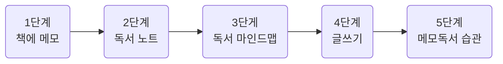
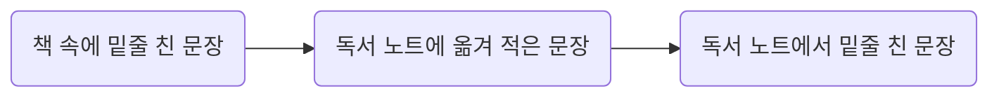

## 1. 메모 독서가 남는 독서다
- 메모 독서는 메모하며 책을 읽는 방법입니다
	- 메모는 잊지 않기 위해 간략하게 적는 것만을 의미하는 것이 아닙니다
		- 넓은 의미로 책과 관련되어 무언가를 쓰는 행위 전체를 말합니다
		- 책의 여백에 간단히 메모하는 것뿐만 아니라, 독서 노트에 책의 문장을 옮겨 적고, 책을 읽은 다음에 서평을 쓰는 것까지 책과 관련된 모든 '쓰는' 활동 모두를 포함
	- 쓰면서 책의 내용을 음미하고, 생각하며 읽는다는 것이 중요합니다
	- 책이 하는 말에 경청하고, 나 자신의 생각에 경청하는 겸손한 독서법입니다
	- 책의 메모 독서법

1. 책에 메모하기
	- 밑줄을 친다
	- 색을 달리하여 중요도를 분류한다
	- 책의 여백에 질문하고, 답을 찾는다
2. 독서 노트 쓰기
	- 중요한 문장, 기억하고 싶은 문장을 필사한다
	- 떠오르는 생각과 질문을 적는다
	- 독서 노트를 다시 읽는다
3. 독서 마인드맵 작성하기
	- 키워드를 뽑는다
	- 범주화를 통해 계층형 목록을 만든다
	- 색상이나 기호로 강조 표시한다
4. 메모 독서로 글쓰기
	- 질문을 찾는다
	- 핵심문장을 쓴다
	- 글의 설계도를 그린다
5. 메모 독서 습관 만들기
	- 규칙적으로 읽는 습관을 들인다
	- 독서 모임에 참여한다
	- 완벽하게 쓰려고 하지 않는다

- 메모 독서를 하면 시간이 많이 걸려 책을 더 적게 읽을 것 같지만 실제로는 그렇지 않습니다. 메모 독서를 통해 깊이 읽기의 맛을 보게 되면 독서가 더 재미있어지기 때문입니다
- 사람들이 책을 읽지 않는 이유는 ~ 독서의 효과를 체험하지 못했기 때문에 책을 읽으려는 동기가 생기지 않은 것이죠. 왜 독서 효과를 체험하지 못하는 것일까요?
	1. 기억하지 못한다
	2. 생각하지 않는다
	3. 글을 쓰지 않는다
	4. 행동하지 않는다
	5. 무언가를 만들지 않는다
- '효과 없는 독서'를 만드는 다섯가지 원인은 다음과 같이 메모 독서를 통해 해결할 수 있습니다
	1. 오래 기억한다
	2. 생각하는 독서를 한다
	3. 글을 쓰게 된다
	4. 행동을 이끈다
	5. 창조적인 일을 한다
- 메모 독서를 시작하기 전에 준비물 챙기기
	1. 메모 독서를 하며 읽을 책 한 권
		- 처음 할 때는 재미있어 보이는 책을 선택하는 것이 좋습니다
	2. 독서 노트
		- 아날로그 방식으로 독서 노트를 쓰며 감을 잡은 뒤 그 다음에 디지털 방식을 시도해 자신에게 더 적합한 것으로 결정하면 됩니다
	3. 필기구
		- 형광펜, 색연필, 다색 볼펜, 연필 등 어떤 필기구라도 좋습니다
	4. 포스트잇 플래그
		- 중요 부분에 붙여두면 책을 덮은 상태에서도 보이기 때문에 바로 찾아 확인할 수 있습니다
		- 플래그 위에 글씨를 쓸 수 있는 제품도 있어 키워드를 적어두면 책에서 필요한 내용을 빠르게 찾을 수 있습니다
---
## 2. 독서에 메모를 더하다
- 책을 깨끗하게 보면 깨끗하게 잊힙니다
	- 메모 독서는 시간을 레버리지 하는 가장 좋은 방법입니다
- 밑줄 치기는 책 내용중에서 중요한 것, 나에게 필요한 것을 선별하는 중요한 작업입니다
	- 밑줄 치기는 나 자신의 정체성과 성장을 확인하는 과정이기도 합니다
		- 다시 Rereading을 하며 과거의 내가 공감했던 문장들을 살펴보면서 내가 어떤 사람인지 다시 확인하는 것이죠
	- 저는 책을 다시 읽을 때 처음 읽을 때 사용했던 것과 다른 색의 형광펜으로 밑줄을 칩니다.
		- 그렇게 하면 새롭게 밑줄 친 문장을 통해 나의 관심사가 어떻게 변했는지도 파악할 수 있습니다
		- 책을 두 차례 읽는 동안 어떻게 성장했는지도 파악할 수 있습니다
	- 선별 작업(=밑줄 치기)을 제대로 하기 위해서는 어떤 기준이 있어야 합니다. 그 기준은 바로 '질문'에서 나옵니다.
		- 그렇다면 가장 먼저해야하는 질문은 무엇일까요?
		1. 저자는 왜 이 책을 썼는가
		2. 저자가 전하고 싶은 핵심 주장은 무엇인가
		3. 핵심 주장에 대한 근거는 무엇인가
		4. 저자가 말하는 내용은 진실한가
		5. 저자의 이야기 속에 숨겨진 의도는 무엇인가
		6. 저자가 말하는 내용은 어떤 가치가 있는가
	- 저자가 중요하다고 강조하지 않은 것들 중에서도 나에게 도움이 되는 내용이 없는지 확인해야 합니다
		1. 내가 가진 문제를 해결할 수 있는 내용은 무엇인가
		2. 나의 관심사와 관련된 내용이 있는가
		3. 새롭게 얻은 지식이 있는가
		4. 내 생각과 다르거나 나를 불편하게 만드는 내용이 있는가
		5. 내 삶을 변화시키는 데 도움이 되는 내용이 있는가
	- 어떤 필기구를 쓰든 한 가지로만 밑줄을 치는 것은 좋지 않습니다
		- 문장의 중요도에 따라 몇 단계로 구분해서 밑줄치는 것이죠
		- 작가의 방법
		1. 중요한 문장: 노란색
		2. 이해가 잘 되지 않는 문장: 파란색
		- 주장에 대한 근거나 정보가 나열식으로 등장할 때는 문장 앞에 번호를 써주는 것이 좋습니다
		- 밑줄치고 난 뒤 핵심 키워드를 주변에 메모하기
		- 두 번째 읽을 때는 다른 색상으로 밑줄 치기
		- 나중에 참조하고 싶은 부분에 플래그를 붙여 책을 펼치지 않아도 눈에 띄게 하기
		- 나만의 밑줄 치기 방법 만들기
- 책을 읽는 도중 생각이 떠오르면 바로 책의 여백에 메모를 해야합니다
	- 책을 읽으며 떠오르는 생각은 책을 더 잘 이해하게 도와주고, 새로운 비즈니스의 아이디어가 되기도 하며, 한 사람의 인생을 바꾸는 계기가 되기도 합니다
	- 독서는 책자체의 내용을 전달해주는 것 뿐만이 아니라 '생각을 만드는 힘'을 가지고 있습니다
	- 머릿속에 떠오른 생각은 금방 휘발되어 사라지기 때문에 생각을 수집하기 위해서는 메모를 해야합니다
	- 어떤 것을 메모해야 할까요?
		1. 생각
			- 책을 읽고 나서의 감상, 문장에 대한 해석, 저자와 다른 견해, 내 삶에 적용해보기 위한 아이디어 등 책을 읽는 동안 떠오르는 모든 생각이 메모 대상입니다
		2. 질문
			- '주장이 옳은가, 근거는 타당한가, 내 삶에 적용하려면 어떻게 해야할까' 등 질문이 떠오르면 해당 문장 근처에 질문을 적고 이 질문에 대답을 찾는 것이 책을 깊이 있게 읽는 방법입니다
		3. 키워드
			- 중요한 부분에 대한 강조도 되고, 나중에 책을 다시 볼 때 원하는 내용을 쉽게 찾을 수 있습니다
			- 책 앞부분의 빈 페이지에 책의 키워드를 메모하고, 해당 페이지 번호를 적는 방법도 있습니다
		4. 요약
			- 읽은 내용이 기억에도 오래 남고, 서평이나 다른 글쓰기를 할 때도 유용하게 사용할 수 있습니다
		5. 도표
			- 책의 내용을 적은 텍스트보다 눈에 잘 띄고, 내용을 쉽게 이해할 수 있게 도와줍니다
		6. 할 일
			- 글쓰기나 다른 연구로 이어지게 도와줍니다
- 새로운 세계를 탐험하면서 왜 기록을 남기지 않습니까?
---
## 3. 독서노트로 독서력을 키운다
- 메모 독서의 핵심 단계, 메모 독서의 꽃
- Book Journal(일기장 등)인 것 처럼 책 일기장인 독서 노트에 책을 읽으며 경험한 것들을 쓰면 됩니다
	- 책에서 만난 인상 깊은 문장
	- 새롭게 알게 된 사실
	- 책을 읽으며 떠오른 생각과 감상
- 왜 독서 노트를 써야할까요
	- 책을 제대로 소화하고 책에서 더 많은 것을 얻기 위해서
- 남들이 잘 정리해 놓은 책 요약본이나 서평을 읽기만 해서는 독서력이 늘지 않습니다
- 독서 노트를 꾸준히 쓰면 어느 순간 훌륭한 독자로 변해 있을 것 입니다
| |아날로그방식|디지털방식|
|--|--|--|
|매체|- 종이노트<br/>- 수첩<br/>- A4 용지|- 워드 문서<br/>- 소셜미디어<br/>-디지털 메모 앱 |
|장점|- 노트와 필기구만 있으면 언제 어디서나 가능함<br/>- 도표나 그림을 자유롭게 그릴 수 있음<br/>- 다양한 필기구와 노트를 써보는 즐거움이 있음<br/>독서 노트가 만질 수 있는 물리적인 실체로 남아 성취감이 큼|- 손필기보다 키보드 입력의 속도가 빠름<br/>- 필요한 내용을 빠르게 검색할 수 있음<br/>- 필기구, 노트 구입할 필요가 없어 소모품 비용이 들지 않음<br/>- 과거의 쓴 독서 노트도 언제나 접근 가능함|
|단점|- 필요한 내용을 검색하기 어려움<br/>- 독서 노트 휴대와 보관시 분실의 위험이 있으며, 소중한 기록을 한순간에 잃을 수 있음<br/>- 노트 구입에 전기적으로 비용이 지출됨|- 도표나 그림을 빠르게 그리기 어려움<br/>컴퓨터가 필요하고 이동 중에 쓰려면 노트북을 휴대해야 함|
|단점 보완|- 독서 노트에 차례, 색인 만들기<br/>- 독서 노트를 스캔하여 PDF 또는 이미지 파일로 저장, 클라우드 서비스에 백업하기|전자펜을 쓸 수 있는 노트북이나 패드 사용하기<br/>스마트폰이나 패드에 휴대용 키보드를 연결하여 독서 노트 쓰기|
- 독서 노트에 쓰면 좋은 7가지
	1. 독서 노트를 쓴 날짜, 책 제목, 저자
	        - 번역서의 경우 원제목이 책의 내용을 더 잘 설명해주는 경우가 많으니 함께 적어주기
	        - 독서 노트에서 필요한 내용을 찾을 때나 독서 노트 내용과 내 삶을 연결 지어 회고할 때를 위해 날짜가 반드시 필요함
	2. 중요 문장(필사)
	        - 밑줄을 잘 쳐두었다면 이 단계가 쉬워집니다
	        - 밑줄 친 문장을 다 옮겨 적으려고 하지말고, 그중에서도 더 중요한 문장을 골라 노트에 옮겨 적으세요
	        - 일정 시간을 정해놓고 합니다
	        - 페이지 번호도 반드시 적어야합니다. 나중에 다른 곳에 인용할 때나 전후 문장을 다시 확인 해야할 때 필요하니까요
	        - 한 글자도 틀리지 않게 책에 있는 문장을 그대로 옮겨 적어야 합니다. 일부만 적거나 요약해서 적으면 나중에 인용할 때 책을 다시 찾아봐야하는 불편이 생깁니다.
	3. 필사한 문장에 대한 내 생각
	        - 그 문장을 내가 어떻게 이해하고 해석했는지 내 생각을 적어보세요
	        - 문장의 내용을 내 삶에 적용하면 어떻게 될지 생각해보고 노트에 적어보세요
	        - 저자의 말을 듣기만 하는 수동적인 독서에서 스스로 생각하는 능동적인 독서로 바뀌게 되죠
	        - 필사한 문장과 다른 색의 펜을 사용하여 내 생각을 구별하여 적어야 나중에 독서노트를 살펴볼 때 편합니다
	4. 책을 읽으며 떠오른 질문
	        - 질문을 적어놓으면 그 순간 바로 해답이 떠오르지 않더라도 기억에 오래 남습니다. 그러다 보면 문득 그 질문에 대한 답이 떠오르는 순간이 생깁니다
	5. 책의 핵심 내용 요약정리
	        - 요약정리를 잘해두면 나중에 책 내용이 기억나지 않을 때 독서 노트에 정리된 내용을 보고 금방 기억을 되살릴 수 있습니다
	6. 책을 읽고 깨달은 것, 얻은 것
	        - 책을 통해 얻은 것을 떠올려보고, 독서 노트에 적는 과정을 통해 그 책의 가치를 확인하고, 책이 가져다준 변화를 인식하게 됩니다
	7. 실천 항목
- 독서 노트에 이 항목들을 모두 채울 필요는 없습니다
	- 책 정보, 중요 문장 필사 두 가지만 해도 좋습니다
- 독서 노트에 책 속 문장을 그대로 필사를 해야 하는 이유
	1. 원래의 문장과 내 생각이 구분된다
		- 저자가 전달하고자 하는 것을 제대로 이해하지 못해 원래 문장의 의미와 다른 내용을 독서 노트에 적어놓을 수 있습니다
		- 독서 노트에 쓰여 있는 것이 내가 생각한 것인지, 책에 있는 말인지 알 수 없게 되죠. 다른 사람의 생각을 훔치는 일이 생길 수 있습니다
	2. 글쓰기 재료를 모을 수 있다
		- 정약용이 500여 권의 저작을 남길수 있었던 것은 그의 독서법 때문이었습니다
		 ```text	
		정독: 정성 들여 자세히 읽는 것
		질서: 읽으면서 생각을 메모하는 것
		초서: 책 구절을 옮겨 적는 것
		```
		- 정약용은 '초서'를 통해 자료를 모으고, '질서'를 통해 생각을 축적하여 많은 책을 쓸 수 있었습니다
	2. 글쓰기 실력이 는다
		- 어떻게 하느냐에 따라 필사가 글쓰기에 도움이 될 수도 있고, 되지 않을 수도 있습니다
		- '의식적으로' 단어와 문장을 고나찰하고, 글의 구조를 파악하며 필사를 해야 글쓰기 실력을 늘리는데 도움이 됩니다
- 독서 노트를 써야하는지 이유
	1. 기억에 오래 남는다
		- 망각이 일어나는 시점에 자연스럽게 복습이 됩니다
		- 복습하기도 좋기 때문에 자투리 시간이 생길 때 훑어보면 손쉽게 책의 내용을 복습할 수 있습니다
	2. 제대로 음미할 수 있다
		- 제대로 음미하기 위해서는 천천히 읽어야 합니다. 독서노트 쓰기는 문장을 제대로 음미할 수 있는 시간을 선사합니다
	3. 제대로 생각할 수 있다
		- 머릿속에 문장이 머무르며 외부 자극으로 작용하고 나의 반응, 즉 생각을 만들어냅니다
		- 독서 노트에 내 생각과 질문을 쓰면서 저자와 대화를 주고받을 때 비로소 능동적인 독서가 됩니다
	4. 생각을 축적할 수 있다
		- 독서 노트를 꾸준히 쓰면 책을 읽으며 가졌던 생각들이 차곡차곡 쌓이게 됩니다. 쌓인 생각으로 글을 쓰는 재료로 사용할 수 있게 됩니다.
	5. 창의적인 생각을 할 수 있다
		- 창의성은 이전에 없었던 완전히 새로운 무언가를 만드는 것이 아닌, 이미 존재했지만 서로 관련이 없던 것을 새롭고 독특한 방식으로 연결하여 쓸모 있는 것을 만드는 것입니다
		- 독서 노트는 생각이 재료를 수집하는 역할을 합니다
			- 독서 노트라는 반응로 안에서 생각이 서로 충돌하고 새로운 아이디어가 합성됩니다
	6. 실천하게 된다
		- 독서 노트에 책을 읽고 깨달은 것과 함께 실천 항목을 적어보세요
			- 독서 노트에 쓴 실천 항목들을 하나씩 습관으로 만들다 보면 삶이 변화하기 시작합니다
- 독서 노트를 쓰는 것 만큼이나 독서 노트 다시 읽기가 중요합니다
	- 기억 속에서 달아난 문장들을 다시 붙잡아놓을 수 있으니까요
	- 주기적으로 독서 노트를 다시 보는 시간을 갖습니다
	- 독서 노트를 항상 가지고 다니고 다니며 자투리 시간이 생길 때마다 꺼내 읽습니다
	- 지금의 관심사나 해결하고 싶은 문제에 연결되는 문장을 만나면 책에 밑줄을 쳤던 것처럼 독서 노트에도 밑줄을 쳐주세요
	- 독서 노트를 처음 쓸 때 사이사이에 여백을 주어 독서 노트를 다시 읽을 때 추가 메모를 할 수 있게 합니다
	- 과거에 쓴 독서 노트를 가지고 다니기 힘들면 스캔하여 PDF로 만들어 스마트폰이나 태블릿 PC에 넣고 봅니다
	- 다음의 순서도로 중요도가 높아집니다
	
```text
세스 고딘 <<이카루스 이야기>>
- 아티스트: 기존 질서에 도전하는 용기와 통찰력, 창조성과 결단력을 갖춘 사람
- 당신이 직접 과감하게 도전하고, 자신의 존재를 드러내고, 새롭고 복잡하고 중요한 가치를 만들어내지 못한다면 아무 일도 일어나지 않는다

지바 마사야 <<공부의 철학>>
인간은 물질적인 현실 그 자체를 살아가는 것이 아닙니다. 항상 언어라는 필터를 거치죠. 인간은 '언어적 가상 현실' 속에서 살아갑니다. 그런데 언어 그 자체는 현실에서 분리되어 있습니다. 언어 그 자체는 현실적으로 무엇을 하는지와 상관없는 다른 세계에 속해 있습니다. 그렇기 때문에 자유로워지기 위해서는 언어의 해방적인 힘에 주목해야 한다.
```

---
## 4. 독서 마인드맵으로 생각을 확장하다
- 마인드맵은 마음속에 떠오르는 생각이나 외부 매체의 정보를 정리할 때 쓸 수 있는 기록법입니다
- 우리의 뇌는 어떤 한 가지 아이디어가 떠오르면 그 아이디어와 연관된 다른 생각들이 여러 갈래로 동시 다발적으로 생겨납니다. 그리고 이렇게 생겨난 아이디어는 또 그와 연관된 다른 아이디어를 만들어냅니다. 이것은 나뭇가지가 뻗어나가는 것과 같습니다
- 창의적 아이디어가 필요할 때, 업무 계획을 세울 때, 글이나 발표 내용을 구상할 때, 책이나 강의 내용을 요약정리할 때 아주 유용한 도구 입니다
- 독서 마인드맵의 기본은 책의 핵심 내용을 뽑아 간략하게 요약하는 것입니다
- 책 내용을 요약하기 위해 사용하는 방법
1. 키워드 뽑기
	- 책을 요약하기 위해서는 가장 먼저 어떤 것이 중요한 내용인지를 판별해야 합니다
	- 책을 읽을 때 핵심 문장에 밑줄을 치고 기호로 표시를 해두거나, 독서 노트에 핵심 문장을 적어두면 키워드를 뽑을 때 도움이 됩니다
2. 범주화-계층 목록 만들기
	- 범주화는 일정한 기준으로 정보를 묶는 작업입니다
	- 키워드를 뽑았으면 책에서 해당 키워드에 관련되는 내용을 찾아 주가지 밑에 부가지에 써줍니다
	- 간략하게 한두 단어로 적는 것이 좋지만, 짧게 요약이 어렵다면 몇 개의 단어로 된 문구 또는 아예 문장으로 적어도 됩니다
		- 중요한 것은 정확한 의미를 전달하는 것이니까요
3. 강조 처리
	- 가지가 복잡하게 뻗어 있을 때는 어떤 것이 핵심 내용인지 빠르게 파악하기 어렵습니다. 그래서 정보의 중요도에 따라 가지의 색상이나 기호 등을 사용하여 강조 처리를 하는 것이 필요합니다
	- 좋아하는 강조 색을 정해 색을 바꿔줘도 좋고, 체크 표시와 같은 아이콘을 강조하고 싶은 가지 위에 붙여도 됩니다
- 잘 만든 독서 마인드맵의 조건
	- 독서 마인드 맵을 가지고 책의 내용을 제대로 복원할 수 있는지를 보면 됩니다
	- 책 내용을 전달하고, 글쓰기 등에 활용할 수 있으면 잘 만든 것입니다
- 독서 마인드맵에 책의 내용만 요약하지 말고 여러분의 생각을 담으세요
	- 책을 통해 깨달은 것, 그 결과로 도출한 해야 할 일까지 써넣으면 독서 마인드맵이 완성됩니다
- 독서 마인드맵을 만들면 좋은 점
	1. 전체 흐름을 파악할 수 있다
	2. 더 잘 이해할 수 있다
		- 내용이 항목화 되고 순서대로 배열되기 때문에 논리적 흐름을 따라가며 이해하기 쉬워집니다
	3. 더 잘 기억할 수 있다
		- 다양한 정보를 기억하기 위해서는 속성별로 분류하는 범주화가 필요합니다
		- 마인드맵으로 책 내용을 요약할 때, 책 내용 중에서 중요한 것만 선별하기 때문에 기억해야 할 정보량 자체를 줄여주는 효과가 있습니다
	4. 한 장으로 요약할 수 있다
	5. 필요한 내용을 쉽게 찾을 수 있다
	6. 글쓰기, 강의, 발제에 활용할 수 있다
- 독서 노트에는 없는 독서 마인드맵의 장점
	- 독서노트 = 나무 한 그루 관찰하기
	- 독서 마인드맵 = 숲 전체 바라보기
	- 배타적인 관계라는 것은 아닙니다
	- 독서 노트는 책 속 일부분, 문장 하나에 더 초점을 맞춰서 음미하는 데 적합하고, 독서 마인드맵은 책 전체 구성과 내용간의 관계를 파악하는 데 적합하다는 의미입니다
- 보통은 독서 노트만 쓰는 것으로 충분합니다. 그런데 책 내용이 평소 관심이 있던 주제이거나 공부나 업무에 필요해서 책 전체를 씹어 먹고 싶다면 독서 마인드맵을 만들면 좋습니다
---
## 5. 메모 독서의 완성, 글쓰기
- 굳이 글을 써야 하는 이유
	1. 전문가가 되기 위해
		- 전문가라고 소개되는 사람들의 공통점은 해당 분야에 관한 글을 쓰는 사람들이라는 것입니다
	>      디지털 시대가 발전하면 할수록 글을 쓰는 사람이 기회를 얻게 될 것이다. 오늘날 큰 성공을 거둔 사람들 모두는 말하기와 글쓰기에 탁월한 실력을 갖추고 있음을 우리는 어렵잖게 발견한다. 글을 잘 쓰는 사람이 미래를 얻게 될 것이다. <<타이탄의 도구들>>
	2. 나 자신을 알기 위해
	 > 쓰기 연습을 통해 우리는 삶을 버텨낼 힘을 얻고, 경험한 것에 대해 자신감을 갖게 되며, 자기가 가치 있는 삶을 살고 있다는 믿음을 키운다. <<뼛속까지 내려가서 써라>> 	
	3. 책을 제대로 소화하기 위해
		- 책에서 얻은 생각을 내 삶에 통합하기 위해서는 글을 써야 합니다
		- 따로 흩어진 생각의 조각들을 서로 결합하고, 빠진 부분을 메꾸어 하나의 완성된 형태, 결론이 있는 이야기로 만들어야 합니다. 누군가에게 들려줄 수 있는 이야기여야 내 삶에도 통합시킬 수 있습니다
		- '책 읽기 -> 독서 노트 쓰기 -> 글쓰기'의 3단계를 통해 하나의 주제가 내 안에 완전히 자리 잡게 됩니다
	4. 자신의 경험으로 다른 사람들에게 도움을 주기 위해
		- 내가 경험한 것을 글로 쓰면 누군가는 그 글을 읽고 도움을 받게 됩니다
		- 설령 자기 자신을 위해 글을 썼다 하더라도, 결과적으로 글을 쓰는 사람은 다른 사람들을 돕게 됩니다
- 글쓰기의 필요성을 알고 있어도 쉽지 않은 이유
	- 글쓰기 방법을 제대로 배운 적이 없습니다
- 쓰는 사람은 무엇이 다른가
	- 쓰는 사람의 마음속에는 물음표가 있습니다
	- 해결하고 싶은, 아니 해결하지 않으면 안 되는 질문이 머릿속을 가득 채우고 있는 사람이 글을 씁니다
- 나를 위한 서평쓰기
	- '질문 만들기  -> 질문에 관련된 내용 찾기 -> 글쓰기' 의 프로세스
- 글쓰기가 어려운 분들은 질문을 가지고 책을 읽어보세요. 그리고 꾸준히 독서 노트를 써보세요
	- 독서 노트가 쌓이면 자연스럽게 글로 표현하고 싶어질 것입니다
- 글쓰기라는 어려운 과제를 잘게 쪼개 하나씩 해결하면 글쓰기가 쉬워집니다
	1. 질문을 만들자
		- 좋은 질문이 좋은 글을 만듭니다
		- 내가 해결하고 싶은 문제가 무엇인지부터 써보세요
	2. 핵심 문장을 써보자
		- 문제를 해결하기 전에 임시로 세우는 가설이라고 생각하세요
		- 글을 쓰다가 수정하더라도 일단 현시점에서 내 생각을 써보는 것이 중요합니다
	3. 글의 설계도를 그리자(개요 짜기)
		- 글의 부속품이 될 내용의 목록을 만들어야 합니다
		- 글의 개요를 짤때는 일단 생각나는 대로 써보고, 앞뒤로 내용의 순서를 바궈가며 여러 가지 글의 내용의 순서를 바꿔가며 여러 가지 글의 흐름을 시험해보는 것이 좋습니다
		- 설계도 만드는 법
			1. 진짜 하고 싶은 말 파악하기(핵심 문장 써보기)
			2. 문제를 잘게 쪼개기(단락으로 나누기)
			3. 하나씩 해결하기(단락 하나씩 내용 전개하기)
			4. 일단 쓰고 분류하기
			5. 여러 가지 순서로 조합해보기
- '남을 위한 글쓰기'는 독자들을 위해, 지속적인 글쓰기를 위해 반드시 필요한 목표입니다
	- 책 <<히트 메이커스>>는 '남을 위한 글쓰기'에 도움이 되는 인사이트가 담겨있습니다
	- 히트 상품의 비밀은 MAYA(Most Advanced Yet Acceptable). 수용 가능한 수준에서 최대한 진보적인 상품이 됩니다
---
## 6. 읽는 사람에서 쓰는 사람이 되는 메모 독서 습관
- 메모 독서가 습관이 될 때까지 적어도 3개월 이상 꾸준히 독서 노트를 써야합니다
- 메모 독서 습관을 만들기 전에 먼저 읽는 사람이 되어야 함
1. 독서 습관 목표 세우기
2. 책 읽는 시간 고정하기
3. 자투리 시간 활용하기
4. 독서 목록 만들기
	- 독서량을 정량적으로 확인할 수 있다
	- 읽은 책 권수가 늘어나면 성취감을 느낄 수 있다
	- 어느 분야에 관심이 있는지 확인할 수 있다
	- 재독하거나 다른 사람에게 추천할 책을 고를 수 있다
	- 독서 습관이 자리 잡힌다
5. 자랑하기
- 내재적인 동기만으로 책 읽는 습관을 만드는 것이 힘들다면 외부에서 도움을 받으면 됩니다 -> 독서 모임에 가입
- 독서 모임 장점
	- 다양한 책을 만날 수 있다
	- 다양한 관점으로 책을 이해할 수 있다
	- 삶이 더 행복해진다
	- 독서 습관이 만들어진다
- 독서 모임 발제를 수동적인 학습 방법보다 집기억에 더 오래 남는다
- 독서 노트를 꾸준히 쓰는 비결
	- 너무 열심히 쓰려고 하지 마세요
	- 책의 일부분만 정리해도 됩니다. 한문장만 옮겨 적어도 충분합니다
- 목표를 가지고 메모 독서를 해보세요. 메모 독서를 통해 산출물을 만드세요. 메모 독서의 선순환을 만들어보세요. 효과를 체험할 수 있기 때문에 계속할 수 있습니다 
---
