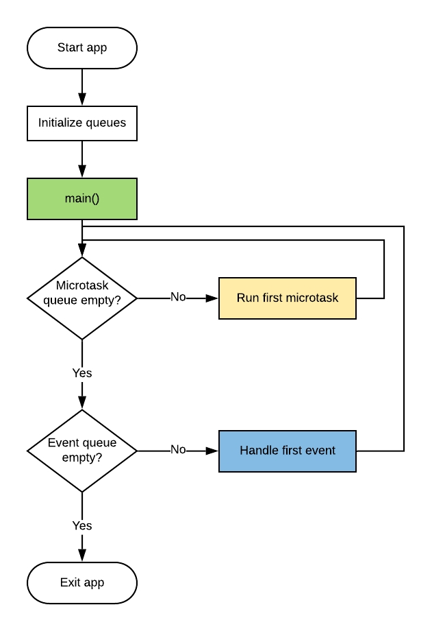
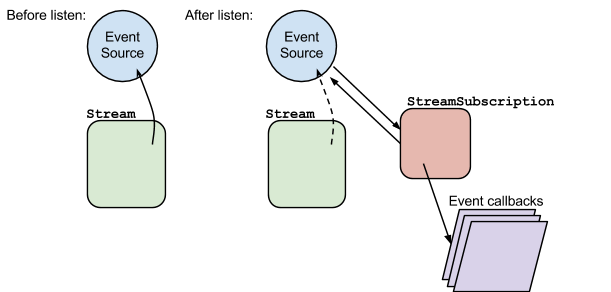
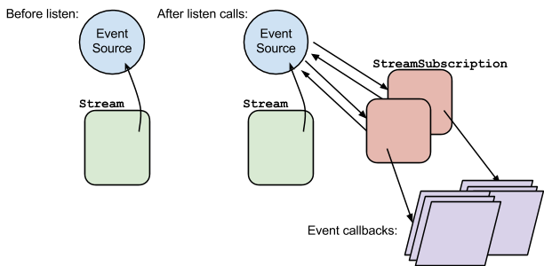
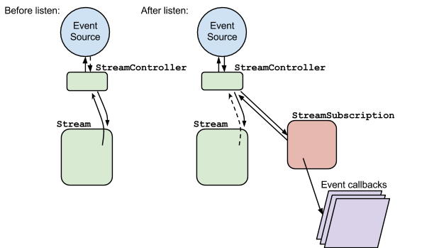

- **Dart**는 **Single-threaded language** 이다
  - 하지만 이 말은 병렬로 코드를 수행할수 없다는 의미가 아니다
- 현대 언어는 Modern, Asynchronous, Reactive 한 방법을 제공해야한다
- 그렇다면 어떻게 Future, Stream 을 지원하는가?
  - Isolate 이 Dart 의 Asynchrony 를 가능하게 함
  - isolate 이라는 이름은 runtime 이 다른 isolate 들을 메모리 공간에서 철저하게 분리하기 때문에 붙은 이름
    - race condition 을 막기 위함

## Isolate

- 모든 Dart 코드가 구동되는 곳
- 각각의 isolate 은 각각 독립적인 event queue 와 operation 을 가짐
- Memory 일부를 할당한 곳
- Dart 에서는 각각의 thread 가 모두 각각 메모리의 Isolate 에 존재하고 Events 를 처리하게 됨
- 많은 앱에서 main isolate 은 개발자가가 걱정해야 하는 것이지만, 프로그램의 main isolate 를 차단하지 않고 길거나 어려운 계산을 실행하기 위해 새로운 isolate 을 생성할 수 있음
- 모든 Dart 코드는 모든 코드를 Single Isolate 에서 구동한다
  - 필요한 경우에는 isolate 을 더 추가할 수 있다
- Main Isolate 에서 수행할 경우 frame drop 이 일어날 정도로 큰 computation 이 필요할 경우, Isolate.spawn() 을 이용하거나 compute() 을 이용하여 독립적인 isolate 을 생성한다
  - main isolate 은 widget 을 그리는데만 사용할 수 있다
- 새로운 isolate 은 각각의 event loop 와 memory 를 가진다 ⇒ 해당 isolate 을 만든 부모 isolate 도 접근할수 없다 (이름이 isolate 으로 지어진 이유이다)
- isolate 간 정보교환할 수 있는 유일한 방법: 메시지 프로토콜을 이용한 메시지 주고 받기
  - 메모리에 직접적으로 접근할 수는 없음
  - 하나의 isolate 이 메세지를 보내면, 다른 isolate 은 event loop 를 이용해서 메세지를 처리한다
- C++ 랑 다르게 왜 shared memory 를 가지지 못하는가?
  - 그 나름대로의 장점이 있기 때문에
    - isolate 안에서의 memory allocation, garbage collection 은 locking 을 요구하지 않는다 (main isolate 이 바쁘지 않다면 mutating 하지 않기 때문에, 오직 하나의 thread 만 가지고 있기 때문)
    - Flutter app 은 많은 widget 을 빠르게 쌓거나, 쪼개야할 일이 많기 때문에 잘 맞음

## Synchrony

- 각각의 isolate 은 한번에 하나의 연산만 수행함 ⇒ synchrony
- 긴 연산이 있으면 thread 를 막아버릴 것이고, user interaction 에 대응하거나 화면을 업데이트할 시간이 없기 때문에 사용자들이 사용하지 않을 것임
- 해결하기 위한 방법은?

## Thread 안에 있는 것

- Dart 앱이 실행되면 런타임이 격리된 스레드 프로세스를 만듬
- 그 스레드를 위해 2 개의 queue 가 생성됨
  1. microtasks 를 위한 queue
  2. events 를 위한 queue
- main() 실행 후 모든 것이 다 수행되면 event loop 가 실행됨
- process 가 실행되는 동안 microtasks 와 events 는 각각의 queue 로 들어가고 event loop 에 의해서 각각의 차례에 처리됨
- event loop 는 수행해야할 코드가 없을 때, 계속해서 microtasks 와 events 를 확인하는 무한 루프



## Microtasks

- 비동기적으로 실행되어야 하지만 이벤트 루프에 제어를 반환하기 전에 완료되어야 하는 매우 짧은 코드 작업을 위한 것
- 이벤트보다 우선 순위가 높기 때문에 항상 이벤트 대기열이 확인되기 전에 처리됨
- 일반적인 Flutter 또는 Dart 앱이 microtask queue 에 코드를 추가하는 것은 비교적 드뭄
- 형태

```dart
void updateState() {
  myState = "New State";
  
  scheduleMicrotask(() {
    rebuild(myState);
  });
}
```

- scheduleMicrotask 안의 익명 콜백은 대기 중인 다른 microtask 가 완료된 후 실행되지만 실행이 비동기식이기 때문에 updateState() 가 반환된 후에도 실행됨
- microtask 의 콜백을 매우 짧고 빠르게 만드는게 매우 중요함
- microtasks queue 는 events queue 보다 우선 순위가 높기 때문에 microtask 로 실행되는 긴 프로세스는 표준 이벤트가 처리되지 않도록 하여 처리가 완료될 때까지 애플리케이션이 응답하지 않을 수 있음
- 대부분의 앱에서는 microtask 로 문제를 겪지 않음
  - event queue 와 계속 상호 작용하기 때문에 event queue 에서 문제를 겪을 가능성이 높음

## Event

- 더이상 microtask 가 없을 때, event queue 가 처리됨
- 앱이 시작되고 끝나는동안 많은 event 가 생성되고 처리됨
  - User Input(taps, clicks, keypress)
  - 네트워크 혹은 저장소 I/O
  - Timer
  - Future
  - Stream

## Event Loop

- Dart 의 async 코드를 가능하게 만들어주는 것
- App 의 Lifecycle 에서 중간에 작은 이벤트들 (ex. 디스크 IO, 사용자의 tab) 은 언제 발생할지, 어떠한 순서로 발생할지 모르고, 이 모든 일을 막힘 없이 Single Thread 로 해내야 한다
  - 이러한 이유로 event loop 을 구동한다
- Event Loop 는 event queue 로 부터 가장 오래된 이벤트를 받아 처리, 다음 처리를 event queue 가 비워질 때까지 반복한다
- app 이 구동되는 동안 event loop 는 계속 돌아가고, 이벤트가 들어오면 한번에 하나의 이벤트를 처리한다
- Future, Stream, async, await 같은 고차원 API 는 모두 이 간단한 event loop 위에 만들어져 있다
- eg. Button 에 onTap 콜백을 이용하여, Network request 를 가져온다

```dart
ElevatedButton(
  child: Text("Remote Request"),
  onTap: () async {
    final myFuture = http.get("<https://example.com>");
    myFuture.then(
      if (response.statusCode == 200){
        print("Success!");
      }
    );
  },
)
// Event loop는 onTap이 들어올때까지 기다린다
// 이벤트가 들어오면 event queue에 쌓이고 Flutter의 rendering system이 ElevatedButton의 이벤트라고 확인하고 onTap function을 수행한다
// Future 함수이니, Future을 위한 completion handler(=.then() 메소드)를 등록하고 처리된 후 handler 내부의 코드를 처리한다
// 처리가 끝난 후 event queue에서 이벤트 제거한다
```

- 과정
  - Event loop 는 onTap 이 들어올때까지 기다린다.
  - 이벤트가 들어오면 event queue 에 쌓이고 Flutter 의 rendering system 이 ElevatedButton 의 이벤트라고 확인하고 onTap function 을 수행한다.
  - Future 함수이니, Future 을 위한 completion handler(=.then() 메소드) 를 등록하고 처리된 후 handler 내부의 코드를 처리한다.
  - 처리가 끝난 후 event queue 에서 이벤트 제거한다
- 이 widget 뒤에 숨겨져 있는 것은 event stream 임
- onTap 은 tap 을 기다리고, Future 은 network 데이터를 기다리지만, Dart 언어의 입장에서 이것들은 그냥 queue 안의 이벤트중 하나일 뿐이다

## Future

- 다른 언어의 future 기능과 비슷함
- data 를 담고 있는 조그마한 선물 상자라고 생각하자
  - 선물 상자를 받아서, 선물 상자를 열고, 선물 상자 안에는 data 나 error 가 들어있음
  - 1) uncompleted, 2) completed with value, 3) completed with error 의 3 가지 state 로 나눌수 있음
- event loop 를 만들고 사용하는 쉬운 방법을 제공하는 고수준 API
- data 요청 process 이벤트가 event loop 에 의해 처리 요청 한 후, event loop 는 data 가 올때 까지 대기하다, data event 가 돌아오면 event loop 에서 data event 처리
- 패턴

```dart
// 1. with callback
http.get("<https://example.com>").then((response) {
  if (response.statusCode == 200) {
    print("Response received.");
  }
  else {
    print("Bad response.");
  }
}).catchError(() {
  print("Error!");
}).whenComplete(() {
  print("Future complete.");
});

// 2. without callback
Future<String> getData() async {
  final response = await http.get("<https://example.com>");
  return response.body;
}
```

- try, catch, finally 와 상응하는 .then(), .catchError(), .whenCompleted() 같은 callback 이 있으므로 상황에 맞춰서 잘 사용해주면 된다
- async: 함수안에 비동기 호출이 있을 때 함수에 사용하는 키워드
- Flutter SDK 는 FutureBuilder 를 사용할수도 있다는 것도 알고 가자

```dart
class MyStatelessWidget extends StatelessWidget {
  @override
  Widget build(BuildContext context) {
    return FutureBuilder(
      future: getData(),
      builder: (BuildContext context, AsyncSnapshot snapshot) {
        if (snapshot.connectionState == ConnectionState.waiting) {
          return CircularProgressIndicator();
        }

        if (snapshot.hasData) {
          return Text(snapshot.data);
        }

        return Container();
      },
    );
  }
}

// 문제
// - 이 접근 방법을 사용하면, build를 수행하며 getData를 여러번 호출할 수도 있음
// - 공식 문서에서는 build 전에 future을 미리 처리하라고 이야기함

class MyStatefulWidget extends StatefulWidget {
  @override
  _MyStatefulWidgetState createState() => _MyStatefulWidgetState();
}

class _MyStatefulWidgetState extends State<MyStatefulWidget> {
  Future<String> _dataFuture;

  @override
  void initState() {
    super.initState();

    _dataFuture = getData();
  }

  @override
  Widget build(BuildContext context) {
    return FutureBuilder(
      future: _dataFuture,
      builder: (BuildContext context, AsyncSnapshot snapshot) {
        if (snapshot.connectionState == ConnectionState.waiting) {
          return CircularProgressIndicator();
        }

        if (snapshot.hasData) {
          return Text(snapshot.data);
        }

        return Container();
      },
    );
  }
}
```

## Completer

- Future 을 만들고, 관리하게 해줌
- asynchrony 하지 않은 callback 라이브러리나 future 로 동작하지 않는 지속연결 상황 같은 것과 소통하기 위해 사용할 수 있음
- completer 를 인스턴스화하면 이를 사용하여 API 호출자에게 future 를 반환할 수 있으며, 긴 비동기 호출이 데이터나 오류를 반환하면 해당 future 를 완료하여 결과를 전달할 수 있음

### 1. 비동기 데이터를 비동기로 받지 않게 설계된 라이브러리의 경우

- 위의 사례와 각각의 callback(=onComplete, onError) 에 completer 를 연결하여 사용
- 이렇게 하므로 더욱 간단한 Future API 를 설계할 수 있게 됨

```dart
import 'dart:async';

Future<String> asyncQuery() {
  final completer = Completer<String>();

  getHttpData(
    onComplete: (results) {
      completer.complete(results);
    },
    onError: (error) {
      completer.completeError(error);
    }
  );

  return completer.future;
}
```

### 2. 지속적인 연결로 메시지를 받는 경우

- socket 등 과 같이 지속 연결과 소통해야한다면, 요청을 보낸후 소켓 서버로 부터 응답을 기다리게 됨
  - 언제 어떤 순서로 응답 혹은 에러가 도착할지 알 수 없음
- completer 와 future 를 사용하여 UI 코드가 이러한 예측 불가능성을 인식하지 못하게 할 수 있음
- 소켓이란?
  - 서버와 클라이언트 간 통신을 위해 계속 지속되는 연결을 만드는 방법
  - 서버와 클라이언트가 통신하기 위해서는 2 가지 방법이 있음
  1. Stateless Scenario
     - REST API 같은 것들
     - 클라이언트가 요청을 할 때, connection 이 만들어지고, 요청이 끝나면 제거됨
  2. Stateful Scenario
     - Socket 같은 것들
     - 서버와 클라이언트 간 통신을 위해 지속 연결을 만듬
     - 인증은 오직 한번만 거치고, 이후 채널을 통해 자유롭게 소통함

```dart
class SocketService {
  final _socketConnection = SomeSocketConnection();
  final Map<String, Completer<String>> _requests = {};

  // socket이 request 받고 예약 처리
  Future<String> sendSocketMessage(String data) {
    final completer = Completer<String>();
    final requestId = getUniqueId();

    final request = {
      'id': requestId,
      'data': data,
    };

    _requests[requestId] = completer;

    _socketConnection.send(jsonEncode(request));

    return completer.future;
  }

  // request 받은걸 확인하고 response 마무리
  void _onSocketMessage(String json) {
    final decodedJson = jsonDecode(json);
    final requestId = decodedJson['id'];
    final data = decodedJson['data'];

    if (_requests.containsKey(requestId)) {
      _requests[requestId].complete(data);
      _requests.remove(requestId);
    }
  }
}
```

## Stream

- 순차적으로 전달되는 비동기 이벤트의 소스
- 데이터 이벤트와 실패 알림인 오류 이벤트가 있음
- 모든 데이터 요소가 내보내지면 stream 이 완료되었음을 알리는 특수 이벤트가 모든 리스너에게 더 이상 데이터 요소가 없음을 알림
- 장점: 코드의 결합성을 낮춰줌
  - stream 을 정의한 객체는 값이 사용 가능해지면 값을 방출할 수 있으며 누가 구독하고 있는지 또는 그 이유에 대해 알 필요가 없음
  - 데이터를 소비하는 객체는 stream interface 만 준수하면 되며 stream 데이터가 생성되는 수단은 완전히 숨겨짐
- Stream 관리를 위한 async 라이브러리의 4 가지 메인 클래스
  1. Stream
     - 데이터의 비동기 Stream 상징
     - 새로운 데이터가 들어오는 것을 알림 받기 위해 리스너들이 구독할 수 있음
  2. EventSink
     - 싱크는 반대 방향으로 흐르는 시냇물과 같은 것
     - EventSink 에 데이터 이벤트를 추가하면 데이터가 연결된 Stream 으로 유입 됨
  3. StreamController
     - Stream 관리를 간단하게 만듬
     - Stream 과 Sink 를 자동으로 만들어주고 Stream 의 행동을 조종할 수 있는 메소드 제공
  4. StreamSubscription
     - 구독에 대한 참조를 저장
     - 이를 통해 수신하는 데이터 흐름을 일시 중지, 재개 또는 취소할 수 있음
- StreamController 를 만들면 Stream 과 EventSink 를 자동으로 만들기 때문에, 두 가지를 따로 선언하는 경우는 잘 없을 것임
  - 데이터 구독자들은 Stream 객체
  - EventSink 는 새로운 데이터를 Stream 에 추가하기 위해 사용됨
  - Stream Subscriber 는 StreamSubscription 인스턴스로 구독을 관리할 수 있음
- 주로 controller 와 sink 는 private 으로 관리되고 stream 은 노출시킨다

```dart
import 'dart:async';

class MyDataService {
  final _onNewData = StreamController<String>();
  Stream<String> get onNewData => _onNewData.stream;
}
```

- 다음과 같이 이해할 수도 있음

| Sync     | Async  |
| -------- | ------ |
| Int      | Future |
| Iterable | Stream |

```dart
void main(){
  var stream = Stream.periodic(const Duration(seconds:1),(x)=>x).take(10);
  stream.listen((x)=>print("data: $x"));
}

// 1. 일정 시간마다 데이터(이벤트)를 만든다
// 2. 스트림에서 만들어지는 이벤트를 관찰하기 시작한다
// 3. listen에서 정의한대로 데이터를 다룬다
```

- 항상 **스트림 만들기 → 연결 (listen) → 데이터 처리** 의 과정을 거친다

```dart
// 다양한 Stream 사용법

void main(){
  // 1.일반적인 데이터를 다룰 때
  Stream.fromIterable([1,2,3,4,5]).listen((x)=>print("take: $x"));
  
  // 2.1초에 1번씩 동작
  Stream.periodic(const Duration(seconds:1),(x)=>x).take(5).listen((x)=>print("take: $x"));
  
  // 3.비동기 데이터를 처리할 때
  Stream.fromFuture(getData()).listen((x)=>print("from future: $x"));
}

Future<String> getData() async {

  return await Future.delayed(const Duration(seconds:5), (){
    print("Fetched data");
    return "data after 5 secs";
  });
}
```

- .stream 을 구독하기 위해서는 .listen() 메소드 사용

```dart
void main(){
  var stream = Stream.fromIterable([1,2,3,4,5]);
  stream.first.then((value)=>print("stream.first: $value"));
  // 결과: 1
  
  stream = Stream.fromIterable([1,2,3,4,12]);
  stream.last.then((value)=>print("stream.last: $value"));
  // 결과: 12
  
  stream = Stream.fromIterable([1,3,5,7,9]);
  stream.isEmpty.then((value)=>print("stream.isEmpty: $value"));
  // 결과: false
  
  stream = Stream.fromIterable([10,20,30,40,50]);
  stream.length.then((value)=> print("stream.length: $value"));
  // 결과: 5
}

// stream을 쓸 때마다 계속 새로 만들어주고 있다
//  - stream.first 실행하고 stream.last 실행하는 것은 안되는가? => 안된다
//  - stream은 기본적으로 single subscription이기 때문에 한군데서만 listen할 수 있다
//    * 여러 군데에서 listen하려면 broadcast로 변경해야 함
```

- 중요한 점: stream 은 구독 하나만 가능하게 셋업 되어 있음
  - 별다른 설정없이 2 개 이상이 구독하면 exception 발생함

```dart
// 다음 같이 map을 이용하여 stream을 수정할 수 있음
void main(){
  var streamMap = Stream.periodic(const Duration(milliseconds:200), (x)=>x).take(3).map((x)=>x+10);
  streamMap.listen(print);
}

// 하지만 복잡한 처리가 힘들다 => StreamTransform을 쓰면 stream을 변경하기 좋다

import 'dart:async';

void main() {
  var transformer = StreamTransformer<Object, dynamic>.fromHandlers(
      handleData: (value, sink) {
    sink.add("First: $value"); // Stream Sink는 스트림 이벤트를 받아들이는 곳이다.
    sink.add("Second: $value");
  });

  var stream = Stream.fromIterable(["Good", 1, 2, 3, 4, 5]);
  stream.transform(transformer).listen((value) => print("listen: $value"));
}
```

- Stream 내부 동작 원리
  - stream 은 다음 3 가지로 구성되어 있음
    1. Stream
    2. StreamSubscription: 스트림과 이벤트의 연결고리, 이벤트에 변경이 생기면 처리함
    3. Data(이벤트)



- listen 하기 전 : 강한 연결, 진한 화살표
- listen 한 후 : 약한 연결, 흐린 화살표, _StreamSubscription 과 EventSource 가 연결됨_

```dart
var streamIter = Stream.fromIterable([10,20,30,40,50]);
StreamSubscription subscription = streamIter.listen((int number) => print(number));
subscription.cancel() // 연결 해제
```

- listen() 에서 이벤트 처리를 하는 것 같았지만, 실제로는 StreamSubscription 에서 이벤트 콜백을 다룬다.
  - 새로운 이벤트가 생기거나, 에러가 생기면, StreamSubscription 에서 이를 처리
  - 이벤트 소스와 연결을 끊을수도 있음

```dart
import 'dart:async';

void main() {
  final stream = Stream.periodic(const Duration(milliseconds: 500), (x) => x);
  StreamSubscription subscription = stream.listen(null);
  subscription.onData((data) {
    print("listen stream: $data");
    if (data == 10) {
      subscription.cancel();
    }
  });

  subscription.onError((err) {
    print("error: $err");
  });
  subscription.onDone(() {
    print("on done");
  });
}

// listen 내부 정의
void main() {
  final stream =
      Stream.periodic(const Duration(milliseconds: 500), (x) => x).take(10);
  StreamSubscription subscription = stream.listen(
    (x) => print,
    onDone: () {
      print("on done");
    },
    onError: (_) {
      print("on error");
    },
  );
}
```

- 두 개 이상에서 구독하기 위해서는 .stream.asBroadcastStream getter 를 사용해주어야 함
  - 아니면 에러를 발생시킴

```dart
var stream = Stream.periodic(Duration(milliseconds: 200), (x) => x)
                  .where((x) => x % 2 == 0)
                  .take(3);
stream.listen(print);
stream.listen(print); // Uncaught Error: Bad state: Stream has already been listened to.

// 해결방법
var sc = StreamController.broadcast();
var broadcastStream = sc.stream;
broadcastStream.listen((v)=>print('broadcast1 $v'));
broadcastStream.listen((v)=>print('broadcast2 $v'));
sc.add(10);
sc.add(20);
```

- broadcast- listen 을 여러번 할 수 있음
- 같은 데이터를 다른 뷰에서 처리할 때 효과적으로 쓸 수 있을 듯



- 함수 사용해서 Stream 생성
  - async*: 제너레이터를 만든다는 의미
    - 제너레이터는 게으르게 (lazily) 데이터 연산을 할 때 쓰임. 게으르다는 것은 미리 연산을 다하는 게 아니라, 요청이 있을 때까지 연산 하는걸 미루어 두었다가 필요할 때 처리하는 것을 뜻함
  - yield: return 과 유사하지만, return 은 한번 리턴하면 함수가 종료되지만, yield 는 열린채로 있어서 필요할 때 다른 연산을 할 수 있음

```dart
void main() {
  var numStream = createStream([1,3,5,7,9]);
  numStream.listen(print);
}

Stream<int> createStream(List<int> numbers) async* { // async*: yield를 사용하겠음
  for (final number in numbers) {
    yield number; // yield: generator를 만듬
  }
}
```

- Custom Stream 을 만드는 방법 : StreamController
  - 여러개의 Stream 을 일일이 열었다 닫는 건 비효율적임 ⇒ 이를 관리하기 위해 StreamController 사용

```dart
import "dart:async";

void main() {
  final ctrl = StreamController();
  final subscription = ctrl.stream.listen(print);

  ctrl.add(10);
  ctrl.add(200);
  ctrl.add(300);

  ctrl.close();

  //final StreamSubscription subscription2 = ctrl.stream.listen((data) => print(data));
  // 에러발생! listen을 여러번 하는 건 안됨. 스트림을 브로드캐스트로 바꿔줘야함.

  ctrl.add(950); // Uncaught Error: Bad state: Cannot add event after closing
}
```



## Asynchronous Generator: async*

- Future 에서 async 통해 비동기적으로 단일 값을 반환하도록 하는 방법처럼 Stream 에서 값을 반환하는 방법
- async* 라고 선언하면 이는 generator function 이라고 불리게 됨
  - function 이 단일 값이 아닌 복수의 값 시퀀스를 생성하는 기능자
- yield : return 과 비슷함. 하지만 return 처럼 함수를 종료하지 않고 한 개의 값을 제공하고 열린채로 다음 값을 요청하기를 기다림
- 장점
  - 제너레이터 함수는 값을 생성하는 데 필요한 모든 시간을 자유롭게 사용할 수 있으며 준비가 되었을 때만 각각을 생성
- Flutter 를 사용하면서 자주 사용할 일이 없음
  - 정말 적당한 순간 일때만 적절하게 사용하여야 함
