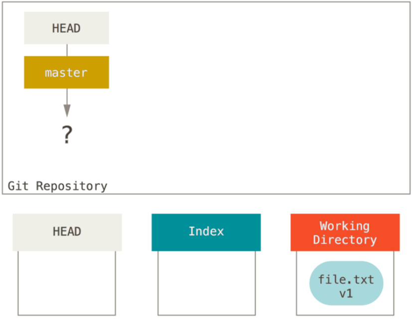
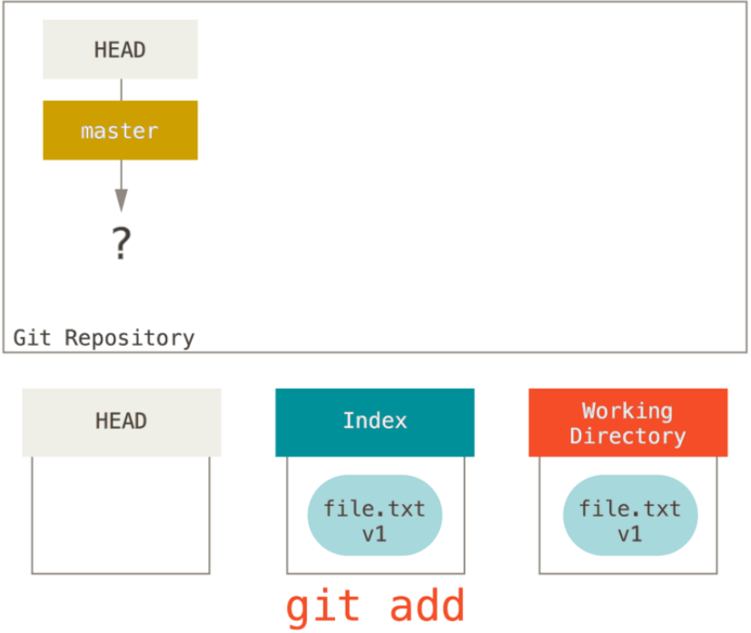
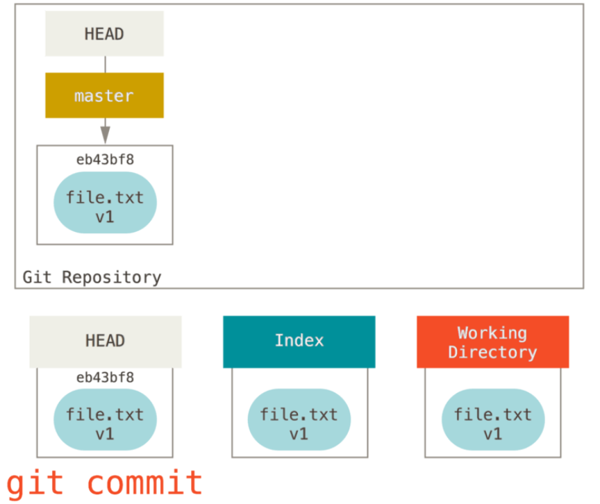
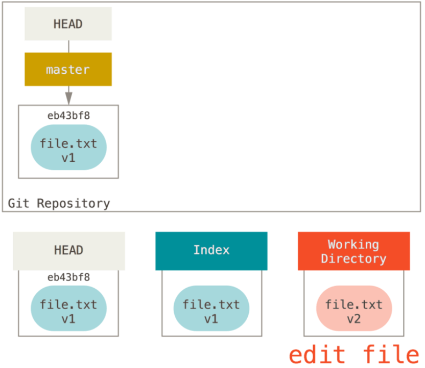
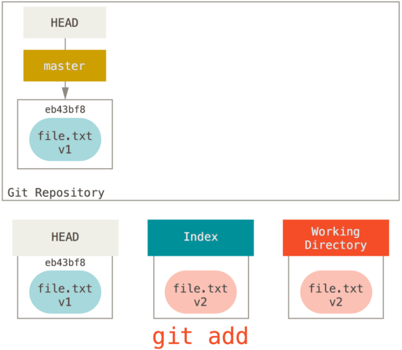
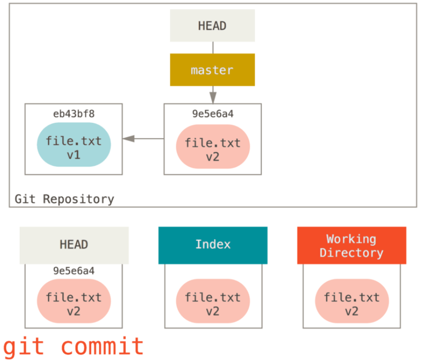

## git 의 주 목적

프로젝트의 스냅샷을 지속적으로 저장하는 것

## Git 구조 이해

비유로 이해

| 트리              | 역할                                      |
| ----------------- | ----------------------------------------- |
| HEAD              | 마지막 커밋 스냅샷, 다음 커밋의 부모 커밋 |
| Index             | 다음에 커밋할 스냅샷                      |
| Working Directory | 샌드 박스                                 |

Git 을 서로 다른 세 트리를 관리하는 컨텐츠 관리자로 생각하면 reset 과 checkout 을 이해하기 쉬움

​트리 : 파일의 묶음 (!=자료구조의 트리)

- Index 는 트리가 아니지만 이해를 편리하게 하기 위해 트리로 가정
- Index 는 평평한 구조임

### [1] HEAD

현재 브랜치를 가리키는 포인터 = 현재 브랜치 마지막 커밋의 스냅샷

### [2] Index

바로 다음 커밋할 사항들

### [3] Working Directory

샌드박스로 생각

커밋하기 전 Index 로 올려놓고 얼마든지 수정할 수 있음

HEAD 와 Index 는 파일과 내용을 효율적인 형태로 .git 디렉토리에 저장함. 사람이 알아보기 어려움.

워킹 디렉토리는 실제 파일로 존재하기 때문에 사용자가 편집하기 수월함

