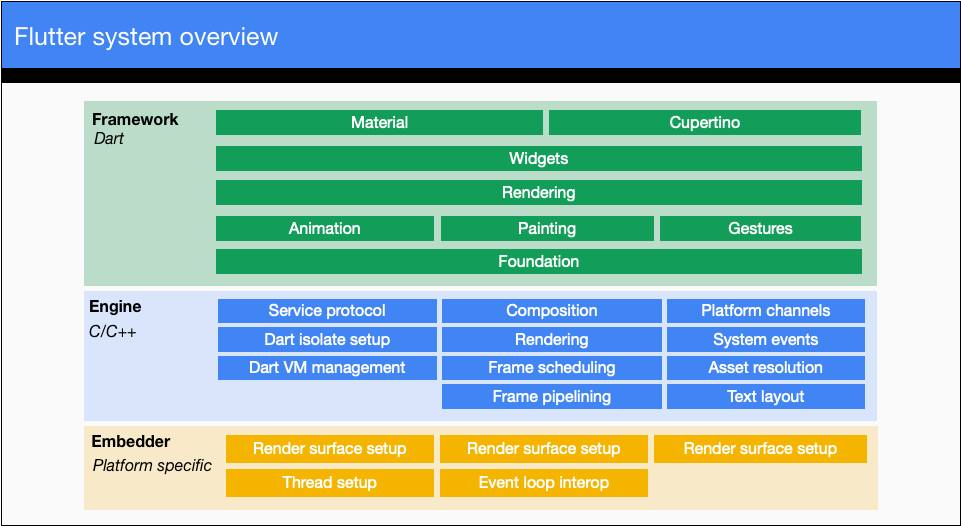
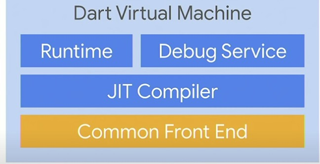
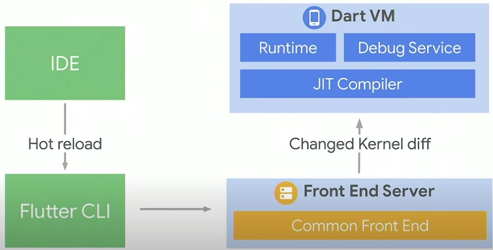
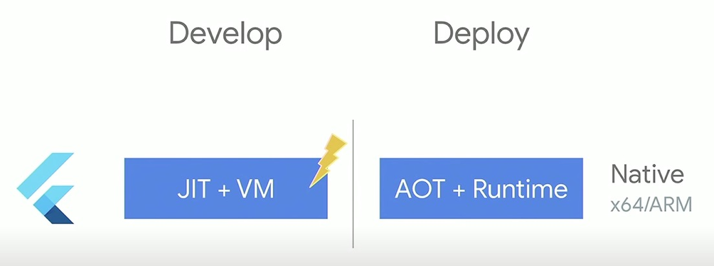
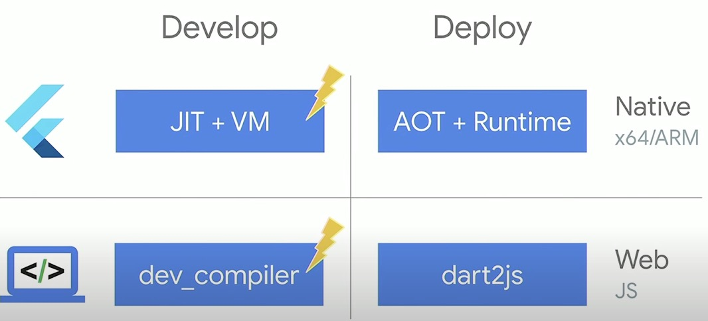
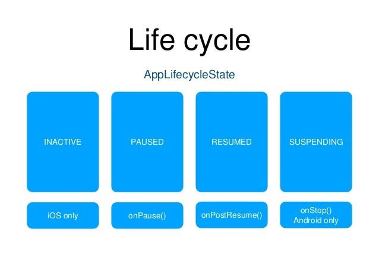
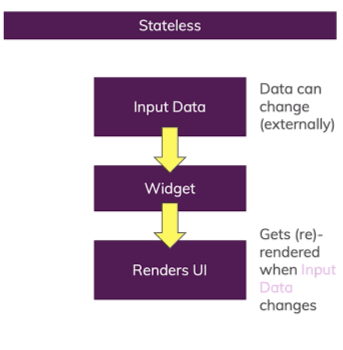
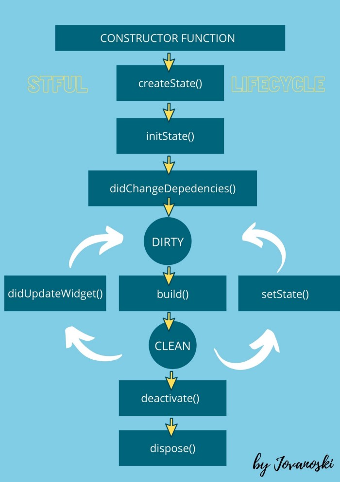

# Flutter interview question

## Flutter?

- 단일 코드베이스에서 모바일, 웹 및 데스크톱용 클라이언트 애플리케이션을 만들기 위한 UI development framework
- SDK, not language
- 대부분 Dart 언어로 만들어짐(engine은 많은 부분 Dart, 나머지 C/C++)

## SDK?

- 애플리케이션 개발을 도와주는 툴 집합(Software Development Kit)
- Compiler, Command Line Tools, Static Analyzer, etc.

## Flutter Structure?



1. The framework level
   - flutter application을 작성할 때 사용하는 모든 것을 포함함
     - 더 저수준의 엔진 계층과 소통하게 해주는 코드인 service class들도 포함

2. The engine level
   - Dart VM, Skia 등 프레임워크 레벨의 기능들을 보증하는 클래스와 라이브러리로 구성되어 있음

3. The platform level
   - 특정 플랫폼(iOS, Android, Windows, …)와 관련된 코드를 포함

## pubspec.yaml?

- flutter/dart 프로젝트에 필요한 모든 의존성(패키지, 파일 등)을 선언한 곳
- 어플리케이션에 대한 제약조건 설정할 수 있음
- 안드로이드의 build.gradle과 비슷하다고 할 수 있음

## Dart? Why Dart for Flutter

- 다른 언어도 고려했지만 Dart 가 새 프레임워크를 위한 기준, 평가사항에서 가장 높은 점수를 받았기 때문
- 고려사항
  1. Productivity: 빨리 무언가를 만들 수 있게 해야함
  2. Fast: 빠른 피드백, 빠른 성능
  3. Multi-platform: 다양한 플랫폼 지원
- 이러한 사항들을 이루기 위해 Dart가 가지고 있었던 것들

1. Productivity
   - Dart는 Multi-Paradigm Modern 언어 이기 때문에 다른 주류언어로 부터 빠르게 적응할 수 있고, 생산성을 위한 중요 기능이 많음
     - Multi-Paradigm: scripting, OOP, functional
       - Modern: lambda, type checker, generic class, type inference
       - feature: type inference
   - UI as a code를 지원하게 만들어줌
     - code 가 줄어들고 declarative 하게 만들어줌
   - language compiler frontend가 개발에 유용한 기능을 제공
     - Analyzer, Language Server
[Dart Common Front End](../assets/dart_cfe.jpg)

2. Fast
   - 빠르게 UI 수정 가능하고 확인이 가능한지

     - CFE가 코드를 컴파일 하여 kernel files or blobs을 내놓으면 VM이 그것을 작동 시킴
       - Runtime은 코드를 최대한 빠르게 동작할 수 있게 하기 위해 동작함

     - JIT 컴파일 시 변경한 사항만 빠르게 컴파일 해서 VM으로 보내줌 => hot reload 가능한 이유
   - 빠른 성능 60 fps


3. Multi-platform


## mixins?

- Mixin은 특별한 유형의 상속에 사용되며 실제로 부모 Mixin 클래스의 자식이 아니더라도 다른 클래스가 사용할 메서드를 상속할 수 있음
- 간단히 말해서, Mixin은 클래스를 확장하지 않고 메서드를 빌릴 수 있는 일반적인 일반 클래스

## Hot Reload?

- 빠르게 UI를 그리고, 기능 추가하고, 버그를 고칠 수 있게 도와주는 기능
- 새로 업데이트 된 소스 코드 파일을 실행 중인 Dart VM에 주입하는 원리로 동작
  - VM이 새 버전의 필드 및 함수로 클래스를 업데이트한 후 Flutter는 자동으로 위젯 트리를 재구축하여 변경 사항을 빠르게 확인할 수 있음

## Hot Restart?

- 저장한 모든 State를 없애고 처음부터 다시 구축

## Key란 무엇인가?

- Key에 대한 설명 참고: [[Flutter-Key]]

## Flutter는 어떻게 동작하는가?

- Flutter 내부 설명 참고: [[Flutter-Under the hood]]

## StatelessWidget vs. StatefulWidget

- Widget
  - element를 위한 설정사항을 정의한 불변 객체
- State
  - UI 를 다시 그리도록 유도할 수 있고, 시간이 지남에 따라 값을 추적하며 바꿀 수 있는 객체
    - Widget의 reference를 가지고 있기 때문에 widget과 state의 값을 모두 접근할 수 있음
    - setState(): state 객체의 property들을 수정하고, UI 업데이트를 유도함
      - state 에 연결된 element를 dirty로 표시함 => 다음 프레임에 자식들을 다시 빌드함
    - state의 유용한 점
      - widget 보다 생명주기가 길어 같은 타입인 경우 기존 widget이 새로운 widget으로 대체되어도 element tree에 계속 존재함
  - StatelessWidget
    - 처음 생성될 때, 부모 widget이 업데이트 될 때만 build 됨
    - 화면을 한번 그리고 바뀔 필요가 없을 때 사용
  - StatefulWidget
    - state가 변경될 때 다시 build 될 수 있음
    - 화면이 계속 바뀌어야 할 때 사용

## InheritedWidget

- Widget tree 안에서 data를 전달하기 위해 사용하는 widget
  - 하위 widget에서 해당 데이터를 사용할 수 있게 됨
- Immutable 하기 때문에 전체 life cycle 동안 데이터가 바뀌지 않음
  - 즉, 데이터를 직접 넣는 것보다, service를 주입하면 됨

## How to access screen size in Flutter?

- MediaQuery를 이용하여, pixel density, aspect ratio, screen size 등에 접근할 수 있다

## Flutter App Life Cycle?

## AppLifeCycleState

- application이 화면에 보여지기 시작할 때 State
- WidgetsBindingObserver mixin을 추가해야 사용할 수 있음
  - initState에 WidgetsBinding.instance!.addObserver(this) 추가
  - dispose에 WidgetsBinding.instance!.removeObserver(this) 추가
- didChangeAppLifecycleState 메소드를 override 하여 각 life cycle에 맞는 로직을 추가할 수 있음


```dart
@override
void didChangeAppLifecycleState(AppLifecycleState state) {
  if (state == AppLifecycleState.inactive) {
  }else if (state == AppLifecycleState.paused) {
  }else if (state == AppLifecycleState.resumed) {
  }else if (state == AppLifecycleState.detached) {
  }
}
```

1. resumed
    - 앱이 표시되고 사용자 입력에 응답
    - 주의! 최초 앱 실행때는 해당 이벤트가 발생하지 않음
2. inactive
    - 앱이 비활성화 상태이고 사용자의 입력을 받지 않음
    - ios에서는 포 그라운드 비활성 상태에서 실행되는 앱 또는 Flutter 호스트 뷰에 해당
    - 안드로이드에서는 화면 분할 앱, 전화 통화, PIP 앱, 시스템 대화 상자 또는 다른 창과 같은 다른 활동이 집중되면 앱이 이 상태로 전환
    - inactive가 발생되고 얼마후 paused가 발생
3. paused
    - 앱이 현재 사용자에게 보이지 않고, 사용자의 입력을 받지 않으며, 백그라운드에서 동작 중
    - 안드로이드의 onPause()와 동일
    - 응용 프로그램이 이 상태에 있으면 엔진은 Window.onBeginFrame 및 Window.onDrawFrame 콜백을 호출하지 않음
4. suspending
    - Android에만 존재하는 detached 상태
5. detach
    - 응용 프로그램은 여전히 flutter 엔진에서 호스팅되지만 "호스트 View"에서 분리
    - 앱이 이 상태에 있으면 엔진이 "View"없이 실행
    - 엔진이 처음 초기화 될 때 "View" 연결 진행 중이거나 네비게이터 팝으로 인해 "View"가 파괴 된 후 일 수 있음

### Flutter Widget Life Cycle?

## StatelessWidget



- build 된 이후 update 되지 않음

## StatefulWidget



### 1. createState()

- widget을 위해 mutable state을 만듬
- framework가 여러번 호출할 수 있음
  - tree 여러 곳에 widget이 삽입 되어 있다면 각각 state를 생성할 것임

### 1-1. mounted(true)

- state 객체와 BuildContext를 연결함
- state가 현재 element에 inflate 되었는지 나타냄
- 생명주기 단계에 실제로 표시되지 않고 background에서 처리됨

### 2. initState()

- widget이 생성되고 처음 호출되는 메소드
- super.initState(); 를 반드시 호출해야함
- tree에 객체가 주입되었을 때 불려짐
- 생성될 때 한번만 불림
- BuildContext를 사용할 수 없다
- HTTP request 관리, 위젯 데이터 변경할 수 있는 stream 구독, 알림변경 또는 기타 다른 object를 핸들링하는데 사용하는 것을 추천

### 3. didChangeDependencies()

- initState 다음 호출되는 메소드
- State의 의존성이 바뀔때 호출 됨
- BuildContext.inheritFromWidgetOfExactType 을 호출할 수 있는 첫번째 method
- 의존성이 바뀔 때 항상 build가 호출 되기 때문에 자주 override하지 않음
  - 하지만 의존성이 바뀔 때 network fetch을 하는 등 값비싼 작업에는 사용하기 좋음

### 4. build()

- user interface를 선언하는 부분
- 다양한 상황에 build 메소드를 호출함
  1. didUpdateWidget 다음
  2. setState 다음
  3. State의 의존성이 바뀐 경우 (ex. InheritedWidget이 바뀐 경우)
  4. deactivate 한 이후 다른 곳에 다시 삽입한 경우
- 매 frame마다 호출될 수도 있음 ⇒ 그러므로, 매 frame마다 호출되는 시간이상 걸릴 수 있는 연산이 있으면 안된다. (ex. 60fps 기준 1frame당 17ms 이상 시간이 걸리는 연산을 build 안에 넣어서는 안된다)
- 이 메소드에 의해 flutter는 subtree를 업데이트 하거나, 삭제하는 것을 판단
  - subtree의 root를 업데이트할 수 있는지 Widget.canUpdate 메소드를 확인하여 수행함

### 5. didUpdateWidget()

- parent widget이 바뀌거나, 같은 runtime type으로 다시 build 해야할 경우, 호출 됨
- flutter가 state를 재사용하기 위해 있는 메소드
- didUpdateWidget 이후에는 반드시 build 메소드가 불림
  - 그러므로 didUpdateWidget 안의 setState는 중복임
- super.didUpdateWidget(oldWidget) 으로 시작해야 함
- State의 build 메소드가 스스로 state를 바꿀 수 있는 객체(ex. ChangeNotifier, Stream) 등에 의존한다면, initState, didUpdateWidget, dispose 등에서 subscribe, unsubscribe 잘 해줘야 함
- 새 widget을 이전 widget과 비교해야 하는 경우에 사용

### 6. deactivate()

- State가 tree 에서 제거 되었지만 현재 frame 안에서 다시 삽입될 수 있을 때 호출 됨
- animation frame 안에 다시 tree로 들어가면 activate 메소드를 불러 deactivate에서 해제하고자 했던 resources 들을 다시 복구함 ⇒ 이후 build 다시 부름
- super.deactivate() 이전에 로직 적용해야 함

### 7. dispose()

- 완전히 State가 tree에서 제거되어 만들어지지 않을 때 호출 됨
- dispose 가 불릴 때 State는 unmounted 되었다고 판단되고, mounted 값은 false
  - setState를 부르는 것은 에러임
- disposed 된 State는 다시 mount할 수 없음
- State의 build 메소드가 스스로 state를 바꿀 수 있는 객체(ex. ChangeNotifier, Stream) 등에 의존한다면, initState, didUpdateWidget, dispose 등에서 subscribe, unsubscribe 잘 해줘야 함

### 7-1. mounted(false)

- dispose() 다음에 state가 tree에 존재하지 않으므로 mounted는 false를 반환함
- state는 다시 mount될 수 없고 setState() 가 호출되면 에러를 발생함

## Factory Constructor vs. Named Constructor?

### Commons

- 더욱 declarative 하게 객체를 생성할 수 있음
- 생성 로직을 노출하지 않고 객체를 생성할 수 있음

### Differences

1. Instance member 접근 여부
   - Factory: static 아닌 이상 접근할 수 없음
   - Named: 접근할 수 있음
2. 반환 구문 여부
    - Factory: 필요함
    - Named: 필요하지 않음
3. 반환되는 instance 타입
    - Factory: 해당 인스턴스의 자식클래스 모두 가능
    - Named: 오직 해당 instance 만 가능
4. 새로운 / 기존 instance
    - Factory: 특정 인스턴스 재사용 가능
    - Named: 항상 새로운 인스턴스 제공

```dart
class Logger {
  final String name;

  static final Map<String,Logger> = {};

  factory Logger(String name) => _map.putIfAbsent(name, () => Logger._internal(name));

  Logger._internal(this.name);
}
```

## const vs. final

- const 는 compile 시에 상수화
- final 은 runtime 시에 상수화

## Null Safety?

- Null이 될 수 없다고 선언한 것은 Null 이 되어서는 안된다는 개념
- non-null인 값은 null check를 할 필요가 없고, 이 과정을 static analyzer가 도와준다
- class 변수는 반드시 선언과 동시에 초기화 시켜야한다
- keyword
  - null type keyword(?), late keyword(late), not nullable type keyword(!), null-aware operator(??)

## BuildContext?

- widget들의 위치에 대한 참조
- element의 추상화 객체
- state 객체를 저장
  - 서로 다른 Widget을 연결한 BuildContext는 서로의 State에 직접 접근할 수 없음

## Tree Shaking?

- 사용되지 않는 모듈을 빌드 과정에서 삭제하는 dead code 삭제 최적화 기술

## Arrow Operator?

- 한줄로 이루어진 Function을 위한 축약어 Operator

## Tween?

- 선형 보간법을 이용하여 시작값에서 끝값까지 sequence를 만드는 객체
- AnimationController와 함께 쓰임

## NetworkImage vs. Image.network?

- Image.network: widget
- NetworkImage: 이미지를 포함하는 클래스

## Flutter Inspector?

- UI Rendering에 문제가 있을 경우 Rendering을 탐색하고 시각화 할 수 있게 해주는 툴

## package vs. plugin

- Package
  - Dart 코드로만 이루어진 외부코드(ex. url_launcher의 Dart API)
- Plugin
  - 각 플랫폼의 Native 코드(Java, Objective C, etc.)로 이루어진 외부코드(ex. url_launcher의 각 플랫폼 실제 구현부)

## Build Modes?

- Debug
  - Assertions와 Service Extension이 활성화됨
- Profile
  - Debug와 Release의 중간 정도의 속도를 냄
  - UI 성능을 테스트하기 위해 사용(에뮬레이터, 시뮬레이터는 실제 성능을 재현하지 않기 때문에 사용할 수 없음)
- Release
  - 앱 배포할 때 사용
  - 설치 공간 크기를 최소화하고 최적화를 극대화

## Test Tools?

- Dart Test
  - Protocol Test, Unit Test에 적합함
  - Network Request, File I/O 테스트 할 수 있음
  - 가장 빠른 테스트
  - UI 를 테스트해볼 수 없음
- Widget Test
  - Flutter Framework 테스트
  - User Journey Test, User Interaction Test 가능
  - 필요하지 않은 부분은 무시하고 테스트 할 수 있음
  - Integration Test 보다 매우 빠름
  - Network Request, Image Rasterization, FIle I/O 같은 것을 테스트해보기 어려움
- Integration Test
  - 실제 앱에서 하는 테스트와 가장 유사한 테스트
  - 실제 기기의 기능을 사용해서 테스트할 수 있음(ex. Push Notification, Payment Integration, Pixel Density)
  - 매우 느린 테스트

## Isolates?

- Isolate에 대한 설명 참고: [[Dart#Isolate]]

## main() vs. runApp()

- dart의 시작 포인트
- flutter의 시작 포인트

## Optional Parameter in Dart

- Ordered Optional Parameter: []
- Named Optional Parameter: {}

둘중 하나만 사용할 수 있음

## State Management?

- 앱 전반에서 같은 데이터를 공유하고 변화에 맞춰서 화면을 변경해주는 방법
- Ephemeral State
  - State Management가 필요없다
- App State
  - State Management가 필요하다

## BLoC Pattern?

- Business Logic Compoent의 줄임말
- State, Event, Bloc 을 하나의 구성으로 하여 Presentation Layer의 UI가 상태에 따라 표현할 수 있는 UI 나타내는 패턴

## How is Flutter native?

- Flutter 는 native platform의 canvas만 사용하여 처음부터 다시 그리게 됨
- native 특정 API 와 연결하고 해야할 일이 없기 때문에 빠름

## AnimationController, Ticker, Tween

1. AnimationController: "Animation"을 관리함. frame 마다 새 값을 생성하고, animation 상태를 추적, forward, reverse, stop 등의 기능을 노출함
2. Animation / Tween: 처음부터 끝까지 curve를 따라 어떻게 값이 변할지 지정할 수 있는 클래스. ValueListenable 프로토콜을 통해서 값 변화를 controller에 알리게됨.
3. Ticker: frameCallback 을 구독하는 클래스. 현재 frame과 이전 frame 사이의 경과 시간을 ticker listener에 전달하는 tick 함수를 호출함.

## resizeToAvoidBottomInset?

- true이면 가상 키보드가 화면에 나타날시 MediaQuery의 MediaQueryData.viewInsets.bottom 의 값에 맞춰서 화면이 조정됨

## TextEditingController?

- 사용자가 텍스트를 수정한 경우, TextEditingController가 listener들에게 값이 변경됬음을 알림

## completed vs. dismissed in AnimationController?

- dismissed: value = 0
- completed: value = 1

## Importance of Ticker?

- Ticker 는 animation의 refresh 주기
- DevTools을 사용할 때 animation을 천천히 진행할 수 있게 해줌

## WidgetsBindingObserver?

- application이 화면에 보여지거나, 사라지는 이벤트를 감지할 수 있는 mixin
