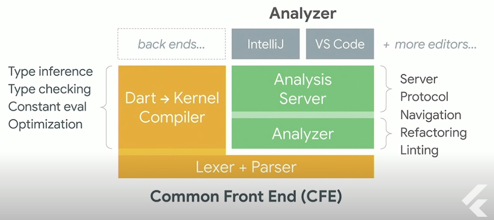

# Flutter interview question

## Flutter?
- 단일 코드베이스에서 모바일, 웹 및 데스크톱용으로 고유하게 컴파일된 아름다운 애플리케이션을 만들기 위한 UI toolkit
- 대부분 Dart 언어로 만들어짐(engine은 많은 부분 Dart, 나머지 C/C++)
---
## Flutter Structure

1. The framework level
	- flutter application을 작성할 때 사용하는 모든 것을 포함함
		- 더 저수준의 엔진 계층과 소통하게 해주는 코드인 service class들도 포함
2. The engine level
	- Dart VM, Skia 등 프레임워크 레벨의 기능들을 보증하는 클래스와 라이브러리로 구성되어 있음
3. The platform level
	- 특정 플랫폼(iOS, Android, Windows, …)와 관련된 코드를 포함
---
## pubspec.yaml?
- flutter/dart 프로젝트에 필요한 모든 의존성(패키지, 파일 등)을 선언한 곳
- 어플리케이션에 대한 제약조건 설정할 수 있음
- 안드로이드의 build.gradle과 비슷하다고 할 수 있음
---
## Dart? Why Dart for Flutter
- 다른 언어도 고려했지만 Dart 가 새 프레임워크를 위한 기준, 평가사항에서 가장 높은 점수를 받았기 때문
- 고려사항
	1. Productivity: 빨리 무언가를 만들 수 있게 해야함
	2. Fast: 빠른 피드백, 빠른 성능
	3. Multi-platform: 다양한 플랫폼 지원
- 이러한 사항들을 이루기 위해 Dart가 가지고 있었던 것들
	1. Productivity
		 - Dart는 Multi-Paradigm Modern 언어 이기 때문에 다른 주류언어로 부터 빠르게 적응할 수 있고, 생산성을 위한 중요 기능이 많음
			- Multi-Paradigm: scripting, OOP, functional
			- Modern: lambda, type checker, generic class, type inference
			- feature: type inference
		- UI as a code를 지원하게 만들어줌
			- code 가 줄어들고 declarative 하게 만들어줌
		- language compiler frontend가 개발에 유용한 기능을 제공
			- Analyzer, Language Server
		
	2. Fast
		- 빠르게 UI 수정 가능하고 확인이 가능한지
		  
			- CFE가 코드를 컴파일 하여 kernel files or blobs을 내놓으면 VM이 그것을 작동 시킴
			- Runtime은 코드를 최대한 빠르게 동작할 수 있게 하기 위해 동작함
		  
			- JIT 컴파일 시 변경한 사항만 빠르게 컴파일 해서 VM으로 보내줌 => hot reload 가능한 이유
		- 빠른 성능 60 fps
		  
	3. Multi-platform
		  
---
## mixins?
- Mixin은 특별한 유형의 상속에 사용되며 실제로 부모 Mixin 클래스의 자식이 아니더라도 다른 클래스가 사용할 메서드를 상속할 수 있음 
- 간단히 말해서, Mixin은 클래스를 확장하지 않고 메서드를 빌릴 수 있는 일반적인 일반 클래스
---
## Hot Reload?
- 빠르게 UI를 그리고, 기능 추가하고, 버그를 고칠 수 있게 도와주는 기능
- 새로 업데이트 된 소스 코드 파일을 실행 중인 Dart VM에 주입하는 원리로 동작
	- VM이 새 버전의 필드 및 함수로 클래스를 업데이트한 후 Flutter는 자동으로 위젯 트리를 재구축하여 변경 사항을 빠르게 확인할 수 있음
 ---
## Key란 무엇인가?
- Key에 대한 설명 참고: [[Flutter-Key]]
---
## Flutter는 어떻게 동작하는가?
- Flutter 내부 설명 참고: [[Flutter-Under the hood]]
---
## StatelessWidget vs. StatefulWidget
- Widget
	- element를 위한 설정사항을 정의한 불변 객체
- State
	- UI 를 다시 그리도록 유도할 수 있고, 시간이 지남에 따라 값을 추적하며 바꿀 수 있는 객체
	- Widget의 reference를 가지고 있기 때문에 widget과 state의 값을 모두 접근할 수 있음
	- setState(): state 객체의 property들을 수정하고, UI 업데이트를 유도함
		- state 에 연결된 element를 dirty로 표시함 => 다음 프레임에 자식들을 다시 빌드함
	- state의 유용한 점
		- widget 보다 생명주기가 길어 같은 타입인 경우 기존 widget이 새로운 widget으로 대체되어도 element tree에 계속 존재함
  - StatelessWidget
	  - 처음 생성될 때, 부모 widget이 업데이트 될 때만 build 됨
	   - 화면을 한번 그리고 바뀔 필요가 없을 때 사용
  - StatefulWidget
	  - state가 변경될 때 다시 build 될 수 있음
	   - 화면이 계속 바뀌어야 할 때 사용
---
## InheritedWidget
- Widget tree 안에서 data를 전달하기 위해 사용하는 widget
	- 하위 widget에서 해당 데이터를 사용할 수 있게 됨
- Immutable 하기 때문에 전체 life cycle 동안 데이터가 바뀌지 않음
	- 즉, 데이터를 직접 넣는 것보다, service를 주입하면 됨
---
