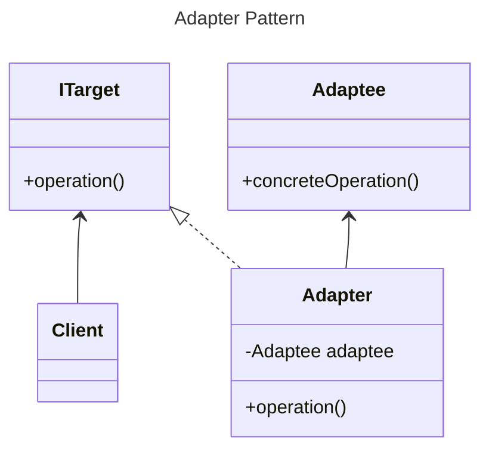

```mermaid
---
title: Adapter Pattern
---
classDiagram
    ITarget <-- Client
    ITarget <|.. Adapter
    Adaptee <-- Adapter
    class ITarget{
        +operation()
    }
    class Adapter{
        -Adaptee adaptee
        +operation()
    }
    class Adaptee{
        +concreteOperation()
    }

```